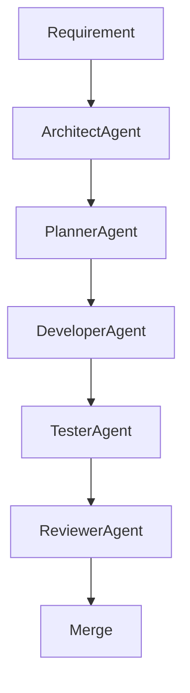

# agentic-workflow-automation-platform

## Project Goals
### Product Goal
- Build a plugin‑based workflow automation platform (Trigger → Condition → Transformer → Action) that can be extended by third‑party developers.

### Engineering Goal
- Showcase a fully‑autonomous, agent‑driven software development lifecycle: requirements → design → implementation → testing → review → documentation → merge.
- Prove that complex engineering processes can be orchestrated by specialized AI agents without human‑written boilerplate code.
- Establish reusable patterns (agents, skills, ADRs) for future projects.

This project is a demonstration of an **Agentic Software Development Process**. While the target product is a plugin-based workflow automation platform, the primary goal is to showcase how specialized AI agents collaborate to design, implement, test, review, and document software autonomously.

## The Domain
The platform implements a **non‑linear workflow pipeline**:
`Trigger` ⇒ `Conditions` ⇛ `Transformers` ⇒ `Actions`

### Domain Example
Consider a simple **Email Alert** workflow:
1. **Trigger** – A timer checks a message queue every 5 min.
2. **Condition** – Only proceed if the message payload `priority` is `high`.
3. **Transformer** – Add a `timestamp` field and redact any `PII` data.
4. **Action** – Send an email via an SMTP plugin.

All four steps are implemented as separate plugins, enabling independent development and reuse across workflows.

### Core Engine Responsibilities
- **Plugin Discovery & Loading**: Locate and load plugins via Python entry‑points
- **Workflow Validation**: Validate plugin contracts and dependencies
- **Execution Orchestration**: Coordinate plugin execution respecting non‑linear execution paths
- **State Management**: Maintain workflow state and context across plugins
- **Error Handling & Recovery**: Implement retry, fallback, and compensation strategies
- **Monitoring & Telemetry**: Collect execution metrics and performance data

### Governance Principles
- **Agentic Decision Support**: Autonomous agents handle design, implementation, and validation under the guidance and final approval of the Lead Architect
- **Agent-Written Core**: Agents implement Core Engine infrastructure (loading, orchestration, state) but **must not** embed business logic
- **Plugin Isolation**: Each plugin operates independently with clear contracts
- **Continuous Validation**: Automated enforcement at every stage

### Execution Context & Governance Boundaries
- **Execution Context**: Immutable data container passed through the workflow pipeline containing input payload, state, metadata, and plugin results
- **Plugin Boundaries**: Plugins execute in isolation with explicit contract validation; no direct access to Core internals
- **Governance Gates**: Automated validation checkpoints at plugin registration, workflow definition, and execution time

## Plugin Architecture
- **Contract‑First**: Each plugin implements a concrete subclass of a core abstract base (`BaseTrigger`, `BaseCondition`, `BaseTransformer`, `BaseAction`).
- **Metadata‑Driven**: Plugins ship a `plugin.yaml` describing type, name, version, entry point, and dependencies.
- **Dynamic Discovery**: The Core Engine loads plugins via Python entry‑points defined in `pyproject.toml`, enabling zero‑code registration.
- **Isolation & Validation**: Plugins are validated against Pydantic schemas at load time; failures are reported by the GovernanceAgent.

## MVP Scope
- **Core Components**: Plugin Contracts, Plugin Registry, Execution Context, Workflow Definition, Workflow Executor
- **Governance**: Agent collaboration under architect oversight
- **Process**: Full pipeline from requirement to merge

## Project Structure
- `/docs`: Architectural decisions (ADRs), RFCs, and user guides.
- `/agents`: Definitions and logic for the autonomous agents.
- `/skills`: Reusable capabilities (codegen, testing, governance) available to agents.
- `/prompts`: System messages and templates for LLM orchestration.
- `/memory`: Persistent context and state snapshots.
- `/src`: The Core Engine and plugin implementations.

## Agentic Workflow
Every feature follows this automated lifecycle:

## Getting Started
Refer to `/docs/architecture.md` for the full technical blueprint and the governance model.
