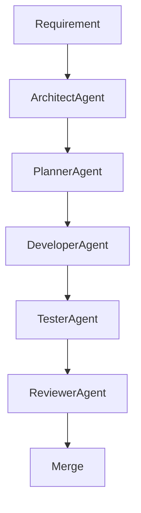

# agentic-workflow-automation-platform

> **Status:** This project is under active development. Features and documentation are evolving rapidly.

> **Note:** This project is currently focused on architecture definition, governance, and implementation planning.
> The architecture documentation (ADRs and C4 diagrams) is the authoritative source of truth while implementation is under development.

## Project Goals
### Product Goal
- Build a plugin‑based workflow automation platform (DAG-based, non-linear pipelines) that can be extended by third‑party developers.

### Engineering Goal
- Showcase a fully‑autonomous, agent‑driven software development lifecycle: requirements → design → implementation → testing → review → documentation → merge.
- Prove that complex engineering processes can be orchestrated by specialized AI agents without human‑written boilerplate code.
- Establish reusable patterns (agents, skills, ADRs) for future projects.

This project is a demonstration of an **Agentic Software Development Process**. While the target product is a plugin-based workflow automation platform, the primary goal is to showcase how specialized AI agents collaborate to design, implement, test, review, and document software autonomously.

## Why This Project Exists
This platform exists to demonstrate two core innovations:

1. **Autonomous Engineering**: It proves that specialized AI agents can orchestrate the entire software development lifecycle—from requirements to merge—without human-written boilerplate. This eliminates repetitive tasks and accelerates development while maintaining architectural rigor.

2. **Plugin‑First Extensibility**: By standardizing plugin contracts and build-time registration, the system provides a foundation for third‑party developers to create reusable workflow components while adhering to strict governance and isolation rules.

Together, these innovations showcase a practical blueprint for scalable, secure, and agent‑driven software systems that can be adapted for future projects.

## Architecture

This platform implements an **agentic software development lifecycle** (ASDL) and **plugin-based workflow automation**, designed to demonstrate autonomy, composability, and governance.

### Core Architectural Principles
1. **Plugin Isolation (ADR-004)**: Plugins execute in sandboxed environments with enforced contract boundaries.
2. **Core Minimalism (ADR-001)**: Core Engine handles only registry loading, lifecycle, and workflow orchestration.
3. **Agentic Development (ADR-008)**: Agent-driven design, code generation, and validation remain separate from runtime.
4. **Build-Time Governance (ADR-009)**: Compliance enforced via static validation gates during CI/CD.
5. **Composable Workflows (ADR-007)**: Workflows are DAGs enabling branching, parallelism, and merge points.

### Core Components
These components embody the architectural principles defined in the ADRs and form the foundation of the platform's runtime behavior.

- **Workflow Runtime (ADR-007)**: Executes the workflow DAG, respecting defined dependencies, non-linear paths, and pruning invalid branches. Validated during build time.
- **Plugin Contract Model (ADR-005)**: Standardizes interfaces via abstract base classes (`BaseTrigger`, `BaseCondition`, `BaseTransformer`, `BaseAction`). Enforced by Pydantic schemas at registration.
- **Execution Context (ADR-006)**: Per-plugin instance isolation boundary that encapsulates memory, threads, and sandbox scopes. Ensures complete isolation even within the same workflow.
- **Build-Time Validation Framework (ADR-009)**: Enforces architectural compliance through gates (Manifest, Contract, Security, Context, Workflow) before deployment.

### System Structure
| Layer | Responsibility | ADR Reference |
|-------|-----------------|---------------|
| **Development** | Agent-driven code, tests, and docs generation | ADR-008 |
| **Runtime** | Core Engine (plugin registry, execution) and plugin isolation | ADR-001, ADR-002, ADR-004 |
| **Governance** | Build-time validation gates and lead architect oversight | ADR-009 |
| **Workspace** | Structured by purpose: plugins, ADRs, agent logic | See `/docs/architecture/c4/` |

## The Domain
The platform implements a **non‑linear workflow pipeline** defined as a **directed acyclic graph (DAG)** of plugin instances. Nodes represent plugin executions (Trigger, Condition, Transformer, Action) and typed edges define data flow between them, enabling branching, parallelism, and merging (see ADR-007).

### Domain Example
Consider a simple **Email Alert** workflow:
1. **Trigger** – A timer checks a message queue every 5 min.
2. **Condition** – Only proceed if the message payload `priority` is `high`.
3. **Transformer** – Add a `timestamp` field and redact any `PII` data.
4. **Action** – Send an email via an SMTP plugin.

All four steps are implemented as separate plugins, enabling independent development and reuse across workflows.

### Core Engine Responsibilities
- **Plugin Registry Loading**: Plugins are statically registered via `pyproject.toml` at build time and loaded from the generated registry at startup. No runtime discovery is performed (see ADR‑002).
- **Lifecycle Management**: Manages plugin lifecycle states (Registered, Activated, Active, Deactivated, Cleaned Up) as defined in ADR‑003.
- **Workflow Orchestration**: Executes the workflow DAG, respecting defined dependencies, non‑linear paths, and per‑instance execution contexts (ADR‑006).

### Governance Principles
Two layers of governance ensure both development quality and runtime compliance.

**Agentic Development Governance (ADR-008)**
- **Agentic Decision Support**: Autonomous agents handle design, implementation, and validation under the guidance and final approval of the Lead Architect.
- **Agent-Written Core**: Agents implement Core Engine infrastructure (loading, orchestration, state) but **must not** embed business logic.

**Runtime Governance (ADR-009)**
- **Plugin Isolation**: Each plugin operates independently with clear contracts (ADR-004).
- **Build-Time Validation Enforcement**: Automated enforcement via five build-time validation gates prevents invalid artifacts from entering the registry.

### Execution Context & Governance Boundaries
Clear architectural boundaries separate plugin execution from core governance.

- **Execution Context (ADR-006)**: Per-plugin instance isolation boundary that encapsulates memory, threads, and sandbox scopes for execution. Each plugin instance receives its own execution context, ensuring complete isolation even within the same workflow.
- **Plugin Boundaries**: Plugins execute in isolation with explicit contract validation; no direct access to Core internals
- **Governance Gates (ADR-009)**: Automated validation checkpoints at plugin registration, workflow definition (pre-deployment)

## Plugin Architecture
- **Contract-First**: Each plugin implements a concrete subclass of a core abstract base (`BaseTrigger`, `BaseCondition`, `BaseTransformer`, `BaseAction`) conforming to the Plugin Contract Model (ADR-005).
- **Metadata-Driven**: Plugins ship a `plugin.yaml` describing type, name, version, entry point, and dependencies for build-time registration (ADR-002).
- **Build-Time Registration**: Plugins are validated during CI/CD, generating a static registry. No runtime discovery is performed.
- **Isolation & Validation**: Plugins execute in isolated contexts with contract validation; failures are reported during validation (ADR-004).

## MVP Scope
- **Core Components**: Plugin Contracts, Plugin Registry, Execution Context, Workflow Definition, Workflow Executor
- **Governance**: Agent collaboration under architect oversight
- **Process**: Full pipeline from requirement to merge

## Project Structure
- `/docs`: Architectural decisions (ADRs), RFCs, and user guides.
- `/agents`: Definitions and logic for the autonomous agents.
- `/skills`: Reusable capabilities (codegen, testing, governance) available to agents.
- `/prompts`: System messages and templates for LLM orchestration.
- `/memory`: Persistent context and state snapshots.
- `/src`: The Core Engine and plugin implementations.

## Agentic Workflow
Every feature follows this automated lifecycle:

## Architecture Documentation

- **ADR Index**: [`/docs/adr/`](docs/adr/) – all Architectural Decision Records
- **C4 Level 0 – System Context**: [`level-0-system-context.md`](docs/architecture/c4/level-0-system-context.md)
- **C4 Level 1 – Container Diagram**: [`level-1-container.md`](docs/architecture/c4/level-1-container.md)
- **Glossary**: [`GLOSSARY.md`](GLOSSARY.md) – key terminology and definitions

## License
This project is released under the [Apache License, Version 2.0](LICENSE).
See the [LICENSE](LICENSE) file for full license text.
