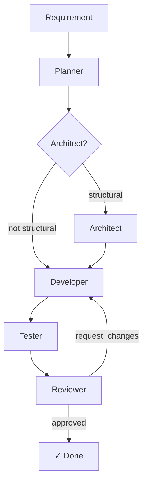
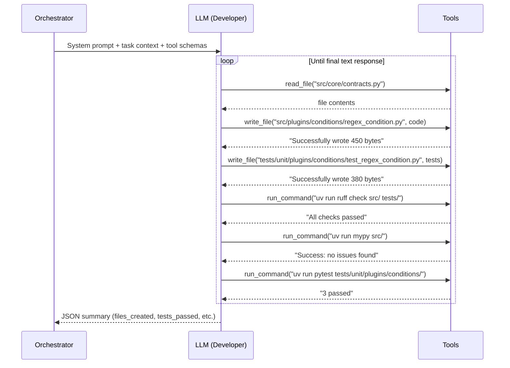
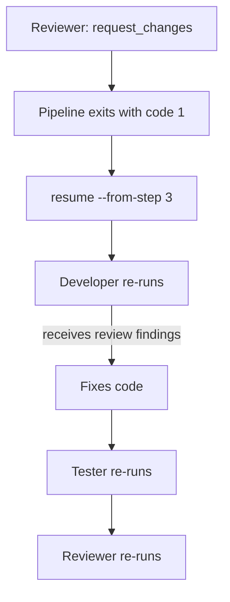

# Agent Flow — How It All Works

> A simple, complete explanation of how a requirement becomes working code through autonomous AI agents.

---

## The Big Picture

When you give this system a requirement (e.g. "Create a RegexCondition plugin"), a **pipeline of 5 specialized AI agents** takes it from idea to merged code — automatically. Each agent has one job, produces one artifact, and passes control to the next.



---

## Entry Point: The Orchestrator

Everything starts with the CLI (`scripts/orchestrator.py`):

```bash
uv run python scripts/orchestrator.py run "Create a RegexCondition plugin"
```

The Orchestrator is **not an AI agent** — it's a Python script (using Typer + Rich) that:
1. Decides which agent to call next
2. Passes context between agents
3. Runs pipeline guards between steps
4. Saves artifacts to `docs/tasks/NNNN/`
5. Blocks the pipeline if something fails

---

## Step-by-Step Flow

### Step 1: Planner Agent

**Goal:** Turn a vague requirement into a structured plan.

**How it works:**
- The Orchestrator sends the requirement text to the Planner via the LLM (single-shot, no tools)
- The Planner returns a JSON object with: objective, scope, plan steps, risks, and acceptance criteria

**Artifact produced:** `docs/tasks/NNNN/task.md`

**Example output:**
```json
{
  "objective": "Create a RegexCondition plugin that evaluates string fields against regex patterns",
  "scope": "New plugin under src/plugins/conditions/",
  "plan": ["Create plugin class", "Add unit tests", "Register plugin"],
  "risks": ["Regex complexity could cause ReDoS"],
  "acceptance_criteria": ["Plugin passes all tests", "Linting clean"]
}
```

---

### Step 2: Architect Agent (Conditional)

**Goal:** Validate the plan against architectural rules (ADRs).

**When it runs:** Only if the task touches structural keywords like "core engine", "plugin contract", "registry", "execution context", etc.

**How it works:**
- Single-shot LLM call (no tools)
- The Architect reviews the plan and checks alignment with ADRs
- Returns: approved/rejected + feedback + referenced ADRs

**Human checkpoint:** Unless `--auto-approve` is set, the Orchestrator asks the user to confirm before proceeding.

---

### Step 3: Developer Agent

**Goal:** Write the actual code and tests.

**How it works — this is the most complex step:**

The Developer uses an **agentic tool-calling loop**. Instead of just generating text, it can interact with the filesystem:



**Available tools (sandboxed):**
| Tool | What it does | Restrictions |
|------|-------------|--------------|
| `read_file` | Read any file in the workspace | Path must stay inside workspace |
| `write_file` | Create/overwrite a file | Only under `src/`, `tests/`, `docs/` |
| `list_directory` | List directory contents | No hidden dirs or `__pycache__` |
| `run_command` | Execute a shell command | Only allowlisted: ruff, mypy, pytest, cat, head, ls, grep, find |

**Ground truth tracking:** The Orchestrator tracks which files the Developer *actually* wrote (via the tool tracker), not just what the LLM *claims* to have written.

**Artifact produced:** `docs/tasks/NNNN/implementation.md`

---

### Post-Developer Guards

Before advancing to the Tester, the Orchestrator runs **pipeline guards**:

| Guard | What it checks | Priority |
|-------|---------------|----------|
| Path Validation | All paths are under allowed directories, no traversal attacks | P2 |
| Artifact Existence | Every claimed file actually exists on disk | P0 |
| Syntax Validation | All `.py` files parse without syntax errors | P2 |

If any guard fails → pipeline is **blocked** with an error message and a `resume` command.

---

### Step 4: Tester

**Goal:** Verify tests actually pass and measure coverage.

**How it works:**
- The Orchestrator runs `pytest` directly (subprocess) — this is NOT the LLM deciding if tests pass
- If tests fail → pipeline blocked
- If tests pass → coverage is measured via `pytest --cov-report=json`

**Quality gates evaluated:**
| Gate | Threshold |
|------|-----------|
| Linting passed | ✓ |
| Type checking passed | ✓ |
| Test coverage | ≥ 80% |

---

### Post-Tester Guards

| Guard | What it checks | Priority |
|-------|---------------|----------|
| Test Execution | `pytest` exits with code 0 | P0 |

---

### Step 5: Reviewer Agent

**Goal:** Code review the implementation and decide: approve, request changes, or reject.

**How it works:**
- The Orchestrator reads the actual source code from disk and includes it in the Reviewer's prompt
- The Reviewer uses **tool-calling** (can read files for deeper inspection)
- Returns: decision + findings (citing specific lines) + suggested improvements

**Key design choice:** The Reviewer sees the *actual file contents*, not just the Developer's claims. This prevents hallucinated approvals.

**Artifact produced:** `docs/tasks/NNNN/review.md`

---

### Pre-Reviewer Guards

| Guard | What it checks | Priority |
|-------|---------------|----------|
| Reviewer Precondition | At least some source files exist on disk | P1 |
| Report-to-Git Consistency | Claimed files match `git diff` output | P1 |

---

## Feedback Loop

If the Reviewer returns `request_changes`:



On resume, the Developer receives:
1. The original task plan
2. The previous reviewer's findings (from `review.md`)
3. The list of previously created files
4. Explicit instruction: "You are FIXING, not starting from scratch"

This creates a tight feedback loop until the Reviewer approves.

---

## The LLM Client

All agent interactions go through `src/agents/llm/client.py`, which provides:

- **Single-shot mode** (`invoke`): For Planner and Architect — send a message, get a response
- **Tool-calling mode** (`invoke_with_tools`): For Developer, Tester, and Reviewer — agentic loop with up to 20 tool iterations
- **Retry logic**: Exponential backoff on empty responses or API errors
- **Provider-agnostic**: Works with OpenRouter, OpenAI, Ollama, or any OpenAI-compatible API

Configuration is via environment variables:
```bash
LLM_API_KEY=...
LLM_BASE_URL=https://openrouter.ai/api/v1
LLM_MODEL=openrouter/free
LLM_MAX_TOKENS=4096
LLM_TEMPERATURE=0.3
```

---

## System Prompts

Each agent has a dedicated system prompt at `src/agents/prompts/{agent}_system_prompt.md`. These prompts define:
- The agent's role and personality
- What it should produce (response format)
- What rules it must follow (ADRs, conventions)
- Available skills and constraints

---

## Complete Pipeline Timeline

```mermaid
gantt
    title Pipeline Execution (typical)
    dateFormat ss
    axisFormat %S s

    section Planner
    Parse requirement & create plan : 0, 5s

    section Architect
    Review architectural alignment : 5, 3s

    section Developer
    Read existing code : 8, 2s
    Write implementation : 10, 8s
    Run validations (ruff, mypy, pytest) : 18, 5s

    section Guards
    Post-developer guards : 23, 1s
    Test execution (pytest) : 24, 5s

    section Reviewer
    Read source code : 29, 2s
    Review & produce findings : 31, 5s
```



---

## Summary Table

| Step | Agent | Mode | Tools? | Artifact | Guard After |
|------|-------|------|--------|----------|-------------|
| 1 | Planner | Single-shot | No | `task.md` | — |
| 2 | Architect | Single-shot | No | — | Human approval |
| 3 | Developer | Tool-calling | Yes (all 4) | `implementation.md` | Path, Existence, Syntax |
| 4 | Tester | Subprocess | N/A (pytest) | — | Test execution |
| 5 | Reviewer | Tool-calling | Yes (read) | `review.md` | Precondition, Git consistency |

---

## Key Design Decisions

1. **Tools > Text**: Agents write files directly instead of outputting code blocks. This eliminates copy-paste errors and enables ground-truth validation.

2. **Guards prevent hallucinations**: The pipeline never trusts the LLM's claims. Every file is verified on disk, every test is actually executed, every path is validated.

3. **Feedback loops are automated**: When the Reviewer requests changes, the Developer gets explicit context about what to fix, avoiding repeated mistakes.

4. **Separation of concerns**: The Orchestrator handles flow control and persistence. The LLM Client handles communication. The Tools handle filesystem access. Each agent handles its domain expertise.

5. **Fail-safe defaults**: If the LLM is unavailable, the pipeline uses static fallbacks. If a guard fails, the pipeline stops and gives a resume command.
