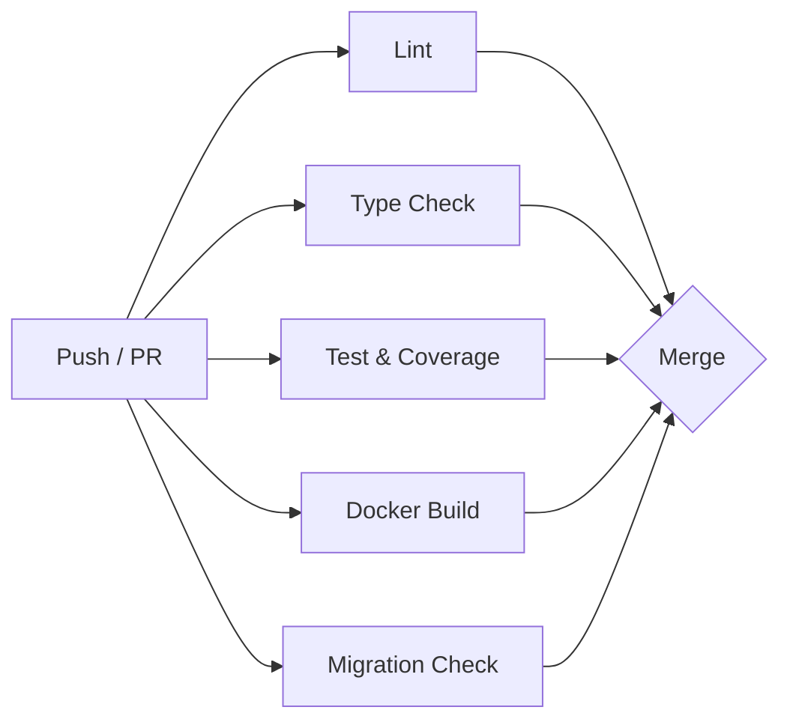

# CI/CD Pipeline




## Overview

The project uses GitHub Actions to enforce quality gates on every push to `main` and every pull request targeting `main`. All jobs must pass for a PR to be mergeable (requires branch protection rules enabled on the repository).

## Workflow File

`.github/workflows/ci.yml`

## Jobs

| Job | Purpose | Fails when |
|-----|---------|------------|
| `lint` | Code style and import ordering | `ruff check` or `ruff format --check` reports violations |
| `type-check` | Static type safety | `mypy` finds type errors in strict mode |
| `test` | Correctness and coverage | Tests fail or coverage drops below threshold |
| `docker-build` | Packaging validation | Dockerfile has broken COPY paths or missing dependencies |
| `migration-check` | Schema consistency | Migrations fail to apply or models have diverged from migration history |

## Job Details

### Lint & Format

Runs two separate checks:
- `ruff check src/ tests/` — catches lint violations (unused imports, naming, complexity)
- `ruff format --check src/ tests/` — ensures code is formatted (does not auto-fix in CI)

### Type Check

Runs `mypy src/` in strict mode. Configuration lives in `pyproject.toml` under `[tool.mypy]`.

### Test & Coverage

- Runs `pytest` with `--cov-fail-under=80` (threshold defined in BRIEF.md Section 7)
- Tests use SQLite in-memory (configured in `conftest.py`) — no database service needed
- Uploads `coverage.json` as an artifact even on failure for post-mortem inspection

### Docker Build

Builds the production Docker image to catch:
- Missing system dependencies
- Broken `COPY` paths
- Dependency resolution failures

Does not run the container or execute tests inside it.

### Migration Check

Spins up a PostgreSQL 16 service container and:
1. Runs `alembic upgrade head` — verifies all migrations apply cleanly
2. Runs `alembic check` — detects model changes that lack a corresponding migration

## Configuration

| Setting | Location | Value |
|---------|----------|-------|
| Python version | `ci.yml` env | `3.12` |
| Coverage threshold | `ci.yml` env | `80%` |
| Ruff rules | `pyproject.toml` `[tool.ruff]` | E, F, I, N, UP, B, A, SIM, D |
| MyPy strictness | `pyproject.toml` `[tool.mypy]` | `strict = true` |
| Test paths | `pyproject.toml` `[tool.pytest]` | `tests/` |

## Branch Protection

For the CI to block merges, enable these GitHub branch protection rules on `main`:

- ✅ Require status checks to pass before merging
- ✅ Require branches to be up to date before merging
- Select all 5 jobs as required status checks

## Running Locally

All CI checks can be reproduced locally:

```bash
uv run ruff check src/ tests/
uv run ruff format --check src/ tests/
uv run mypy src/
uv run pytest --cov=src --cov-fail-under=80
docker build -t agentic-workflow-platform:local .
uv run alembic upgrade head && uv run alembic check
```

## Adding New Jobs

When adding a new CI job:
1. Add the job definition to `.github/workflows/ci.yml`
2. Update this document with the job's purpose and failure conditions
3. Add the job name to branch protection required checks
