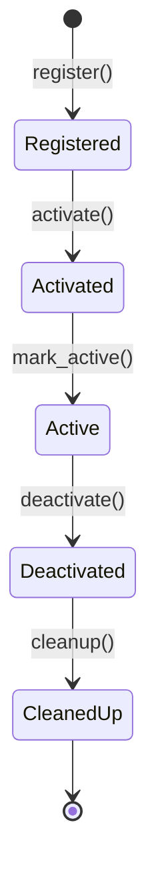
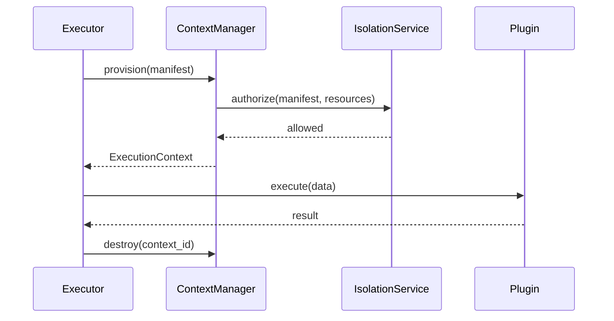
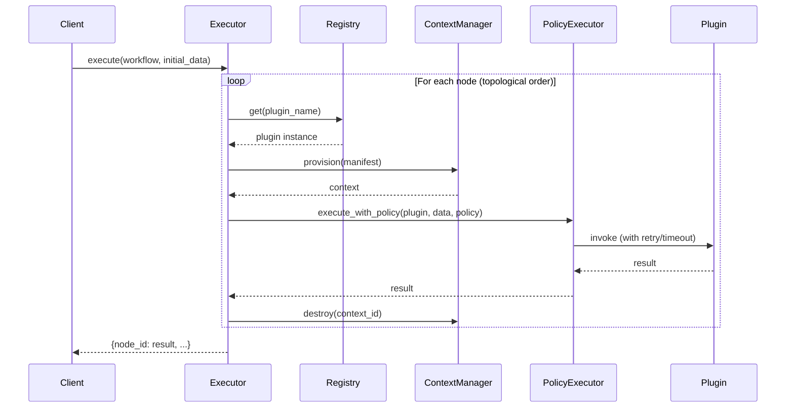
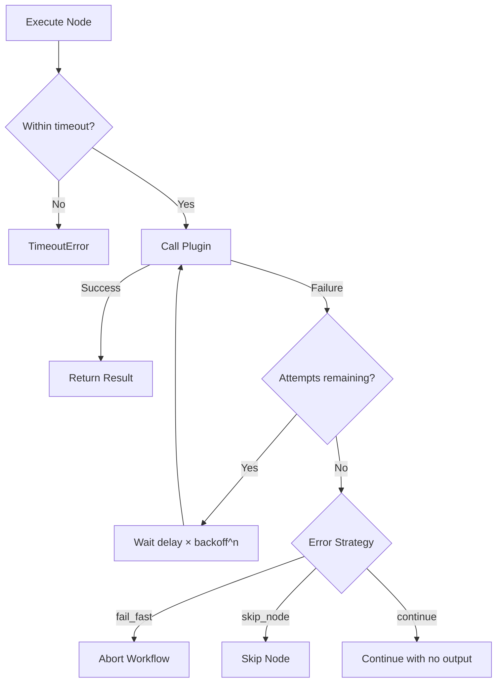
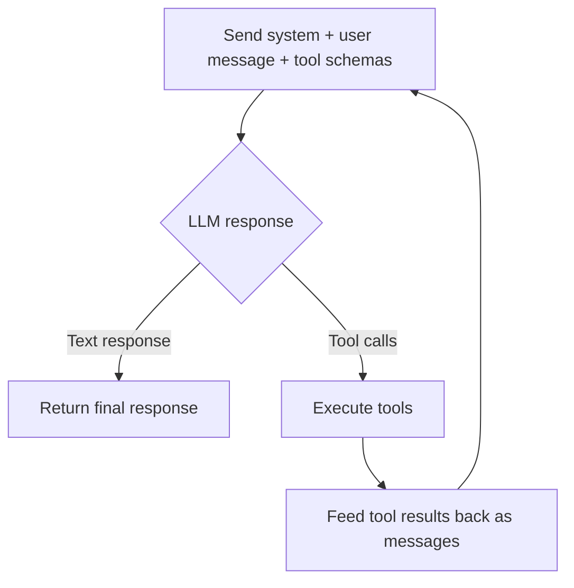
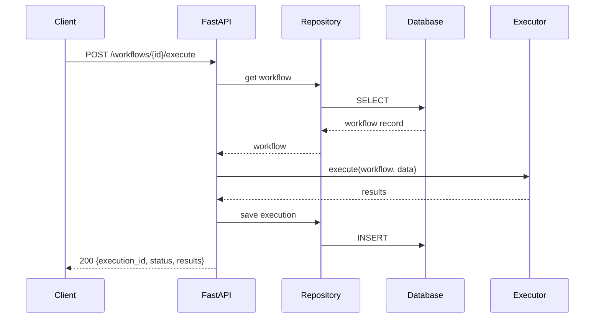

# Developer Guide — Core Engine

> **Audience:** Human developers and AI agents working with or extending the Core Engine.
> This document explains what the system does and how to integrate with it.

---

## Module Map

| Module | Responsibility | ADR |
|--------|----------------|-----|
| `core/manifest.py` | Plugin metadata model (name, type, ports, permissions) | ADR-002, ADR-005 |
| `core/contracts.py` | Abstract plugin interfaces (`TriggerPlugin`, `ConditionPlugin`, `TransformerPlugin`, `ActionPlugin`) | ADR-003, ADR-005 |
| `core/registration.py` | Decorator-based plugin collection for build-time registry generation | ADR-002 |
| `core/registry.py` | Static plugin registry and lifecycle state machine | ADR-002, ADR-003 |
| `core/context.py` | Per-execution isolation boundary and context provisioning | ADR-004, ADR-006 |
| `core/workflow.py` | DAG definition model with built-in validation | ADR-007 |
| `core/executor.py` | Workflow runtime: topological ordering, context provisioning, plugin dispatch, policy enforcement | ADR-006, ADR-007 |
| `core/policies.py` | Execution policies: retry, timeout, error strategies applied per-node | — |
| `core/bootstrap.py` | Application startup: auto-discovers plugin modules, builds live registry | ADR-002 |
| `models/` | SQLModel persistence models | — |
| `repositories/` | Repository pattern for CRUD data access | — |
| `api/routes/` | FastAPI route handlers | — |
| `api/schemas/` | Pydantic request/response schemas | — |
| `governance/engine.py` | Validation Engine: orchestrates gates and produces reports | ADR-009 |
| `governance/gates.py` | Build-time validation gates (Manifest, Contract, Security, Context, Workflow) | ADR-009 |
| `governance/pipeline_guards.py` | Pipeline guards: artifact existence, syntax, test execution, git consistency | — |
| `governance/pipeline_errors.py` | `PipelineGateError` exception for guard failures | — |
| `agents/llm/client.py` | Provider-agnostic LLM client with single-shot and tool-calling modes | ADR-008 |
| `agents/llm/tools.py` | Tool schemas (OpenAI function-calling format) and sandboxed executors | ADR-008 |
| `agents/prompts/` | Per-agent system prompts that define behavior, available tools, and output format | ADR-008 |

---

## How to Use the Core Classes

### 1. Defining a Plugin

Every plugin must subclass one of the four contract types and declare a manifest:

```python
from typing import Any
from src.core.contracts import ActionPlugin
from src.core.manifest import PluginManifest, PluginType, PortSchema


class EmailSender(ActionPlugin):
    @property
    def manifest(self) -> PluginManifest:
        return PluginManifest(
            name="email-sender",
            version="1.0.0",
            plugin_type=PluginType.ACTION,
            permissions=["network:smtp.example.com"],
            inputs=[PortSchema(name="payload", data_type="dict")],
            outputs=[PortSchema(name="result", data_type="dict")],
        )

    def execute(self, data: dict[str, Any]) -> dict[str, Any]:
        return {"status": "sent"}
```

Plugin types and their required methods:

| Base Class | Method to Implement | Returns |
|---|---|---|
| `TriggerPlugin` | `check()` | `dict[str, Any]` — initial payload that flows into downstream nodes (e.g. `{"event": "timer", "payload": {...}}`) |
| `ConditionPlugin` | `evaluate(data)` | `bool` — `True`/`False` decides which branch edges to follow |
| `TransformerPlugin` | `transform(data)` | `dict[str, Any]` — transformed data that replaces the original for downstream nodes (e.g. `{"amount": 100, "currency": "USD"}`) |
| `ActionPlugin` | `execute(data)` | `dict[str, Any]` — side-effect outcome passed downstream and stored in execution results (e.g. `{"status": "sent", "message_id": "abc"}`) |

Lifecycle hooks are optional — override only when needed:
- `on_activate()` — called on Registered → Activated
- `on_deactivate()` — called on Active → Deactivated
- `on_cleanup()` — called on Deactivated → CleanedUp

### 2. Registering Plugins and Managing Lifecycle

Plugins are declared using the `@register_plugin` decorator and collected at build time (no runtime discovery):

```python
from src.core.registration import register_plugin
from src.core.contracts import ActionPlugin


@register_plugin
class EmailSender(ActionPlugin):
    ...
```

The Registry Builder imports plugin modules, calls `get_collected_plugins()`, validates each against the governance gates, and produces the static registry artifact.

At application startup, the `bootstrap.py` module auto-discovers all plugin modules under `src/plugins/`, instantiates decorated classes, and transitions them to ACTIVE:

```python
# This happens automatically via the FastAPI lifespan in src/api/main.py
from src.core.bootstrap import build_registry

registry, context_manager = build_registry()
# All @register_plugin classes are now ACTIVE in the registry
```

The registry enforces a strict sequential lifecycle:



```python
from src.core.registry import PluginRegistry

registry = PluginRegistry()
registry.register(EmailSender())

# Transition through lifecycle before execution
registry.activate("email-sender")      # Registered → Activated
registry.mark_active("email-sender")   # Activated → Active

# After use
registry.deactivate("email-sender")    # Active → Deactivated
registry.cleanup("email-sender")       # Deactivated → CleanedUp
```

Invalid transitions raise `LifecycleError`. Duplicate registrations raise `ValueError`.

### 3. Execution Contexts

The `ContextManager` provisions isolated execution boundaries per plugin instance. Authorization is delegated to an `IsolationService`:



```python
from src.core.context import ContextManager

cm = ContextManager()  # Uses DefaultIsolationService (permits all)
ctx = cm.provision(plugin.manifest)

# ... execute the plugin ...

cm.destroy(ctx.context_id)  # Always destroy after execution
```

To enforce custom authorization policies, implement the `IsolationService` protocol:

```python
from src.core.context import IsolationService
from src.core.manifest import PluginManifest


class StrictIsolation:
    def authorize(self, manifest: PluginManifest, resources: list[str]) -> bool:
        return all(r in ALLOWED_RESOURCES for r in resources)

cm = ContextManager(isolation_service=StrictIsolation())
```

### 4. Defining Workflows

Workflows are DAGs validated at construction time (acyclicity + referential integrity):

```python
from src.core.workflow import WorkflowDefinition, WorkflowEdge, WorkflowNode

wf = WorkflowDefinition(
    name="email-alert",
    nodes=[
        WorkflowNode(node_id="trigger", plugin_name="timer-check"),
        WorkflowNode(node_id="filter", plugin_name="priority-filter"),
        WorkflowNode(node_id="send", plugin_name="email-sender"),
    ],
    edges=[
        WorkflowEdge(
            source_node="trigger",
            source_port="payload",
            target_node="filter",
            target_port="data",
        ),
        WorkflowEdge(
            source_node="filter",
            source_port="output",
            target_node="send",
            target_port="payload",
        ),
    ],
)
```

Construction raises `ValidationError` if:
- Any edge references a non-existent node
- The graph contains a cycle
- Required fields are missing or empty

#### Understanding Edges

Nodes are the "what" (plugins that do work), and edges are the "how data flows between them." They turn a flat list of nodes into an executable DAG by defining dependencies and data routing.

Each edge specifies:

| Field | Purpose |
|-------|----------|
| `source_node` | Node producing the data |
| `source_port` | Which output port of the source to read from |
| `target_node` | Node consuming the data |
| `target_port` | Which input port of the target to write to |
| `condition` | *(optional)* Branch label (`"true"`/`"false"`) for condition nodes |
| `data_type` | *(optional)* Expected type for compatibility validation |

For example:

```json
{"source_node": "trigger", "source_port": "payload", "target_node": "action", "target_port": "data"}
```

This means: take the `payload` output from the `trigger` node and pass it as the `data` input to the `action` node. The executor uses edges to determine execution order (topological sort) and to route data between plugin executions.

### 5. Executing Workflows

The `WorkflowExecutor` ties everything together — it resolves plugins from the registry, provisions contexts, and dispatches execution:



```python
from src.core.context import ContextManager
from src.core.executor import WorkflowExecutor
from src.core.registry import PluginRegistry

registry = PluginRegistry()
# ... register and activate plugins ...

executor = WorkflowExecutor(registry, ContextManager())
results = executor.execute(wf, initial_data={"key": "value"})
# results: {"trigger": {...}, "filter": {...}, "send": {...}}
```

Plugins must be in `ACTIVE` state. The executor raises `WorkflowExecutionError` for inactive plugins and `KeyError` for unregistered ones.

### 6. Execution Policies

The executor applies per-node execution policies for resilience. Policies are declared in the node's `config.policy` field:

```python
from src.core.workflow import WorkflowNode

node = WorkflowNode(
    node_id="send-email",
    plugin_name="email-sender",
    config={
        "policy": {
            "retry": {
                "max_attempts": 3,
                "delay_seconds": 1.0,
                "backoff_factor": 2.0,
            },
            "timeout": {"timeout_seconds": 10.0},
            "error_strategy": "skip_node",
        }
    },
)
```

**Policy components:**

| Component | Fields | Default |
|-----------|--------|---------|
| `retry` | `max_attempts`, `delay_seconds`, `backoff_factor` | 1 attempt, no delay, 2x backoff |
| `timeout` | `timeout_seconds` | 30s |
| `error_strategy` | `fail_fast`, `skip_node`, `continue` | `fail_fast` |

**Error strategies:**

| Strategy | Behavior |
|----------|----------|
| `fail_fast` | Abort the entire workflow immediately on node failure (default) |
| `skip_node` | Mark the failed node as skipped; downstream nodes receive no data from it |
| `continue` | Log the error, proceed to next nodes as if the node produced no output |

Nodes without a `policy` config use safe defaults (1 attempt, 30s timeout, fail_fast).

The `PolicyExecutor` wraps each plugin call in a thread pool to enforce timeouts, and implements exponential backoff between retry attempts.



---

## Agent Infrastructure

The platform uses specialized AI agents to drive the development lifecycle. Agents interact with the codebase through a tool-calling loop powered by the LLM client.

### LLM Client

The `src/agents/llm/client.py` module provides two invocation modes:

| Method | Mode | Use case |
|--------|------|----------|
| `invoke(system_prompt, user_message)` | Single-shot | Agents that only produce text (planner, architect, reviewer) |
| `invoke_with_tools(system_prompt, user_message, workspace)` | Tool-calling loop | Agents that need to read/write files and run commands (developer, tester) |

The tool-calling loop works as follows:



The loop runs up to 20 iterations (configurable via `MAX_TOOL_ITERATIONS`) before raising `LLMError`.

### Available Tools

Tool-enabled agents have access to four sandboxed tools defined in `src/agents/llm/tools.py`:

| Tool | Description | Safety constraints |
|------|-------------|--------------------|
| `read_file(path)` | Read a file relative to workspace root | Path traversal prevention; 50KB truncation |
| `write_file(path, content)` | Create or overwrite a file | Only under `src/`, `tests/`, `docs/`; auto syntax-check for `.py` |
| `list_directory(path)` | List directory contents | Skips hidden dirs and `__pycache__` |
| `run_command(command)` | Execute a shell command | Allowlist: only `ruff`, `mypy`, `pytest`, `cat`, `grep`, `find`, `ls` |

All paths are resolved against the workspace root. Path traversal (`../`) is rejected.

### Agent Roles and Tool Access

The orchestrator (`scripts/orchestrator.py`) automatically selects the invocation mode based on agent role:

| Agent | Mode | Reason |
|-------|------|--------|
| `planner` | Single-shot | Produces structured plans (JSON) |
| `architect` | Single-shot | Reviews for ADR alignment |
| `developer` | Tool-calling | Must explore code, write files, run validation |
| `tester` | Tool-calling | Must write test files and execute pytest |
| `reviewer` | Tool-calling | Reads source files and produces grounded findings |

### Writing Agent Prompts

System prompts live in `src/agents/prompts/{agent_name}_system_prompt.md`. For tool-enabled agents:

1. **List available tools explicitly** — Tell the model what tools it has and their signatures
2. **Define a workflow** — Describe the expected sequence (explore → implement → validate)
3. **Specify final output format** — After tool use, what JSON structure to return
4. **Reference project conventions** — Plugin patterns, test structure, coding style

For single-shot agents:
1. **Define the response format** — JSON schema with required fields
2. **Set clear boundaries** — What to include/exclude
3. **Reference ADRs** — Which architectural constraints apply

### Configuration

Set these environment variables (or in `.env`):

| Variable | Default | Description |
|----------|---------|-------------|
| `LLM_API_KEY` | — (required) | API key for the LLM provider |
| `LLM_BASE_URL` | `https://openrouter.ai/api/v1` | API base URL |
| `LLM_MODEL` | `openrouter/free` | Model identifier (must support function-calling) |
| `LLM_MAX_TOKENS` | `4096` | Maximum response tokens per call |
| `LLM_TEMPERATURE` | `0.3` | Sampling temperature |

> **Important:** The model must support OpenAI-compatible function calling (tool_calls). Models that lack this capability will fail in tool-calling mode.

### Adding a New Tool

1. Add the tool schema to `TOOL_SCHEMAS` in `src/agents/llm/tools.py`
2. Implement the executor function (`execute_<tool_name>`)
3. Register it in `_TOOL_EXECUTORS`
4. Update agent prompts to mention the new tool
5. Add appropriate safety guards (path validation, command allowlisting)

---

## Architecture Constraints

- **ADRs are authoritative.** If code conflicts with an ADR, the ADR wins. Update the code.
- **Core Engine is minimal.** It handles registry, lifecycle, context, and orchestration only. No business logic.
- **Plugin isolation is mandatory.** Plugins never share execution contexts, access each other's state, or reference Core internals.
- **Contexts are ephemeral.** Always provision before execution and destroy in a `finally` block after execution.
- **Lifecycle transitions are sequential.** No skipping states. The registry enforces this.
- **Pipeline guards are mandatory.** The orchestrator enforces artifact existence, syntax validity, and test execution between pipeline steps. No phantom implementations can advance past the Developer step.

---

## Pipeline Guards

The `governance/pipeline_guards.py` module enforces integrity between orchestrator pipeline steps. Guards prevent hallucinated outputs, phantom files, and inconsistent reports from advancing through the agentic development lifecycle.

### Guard Execution Points

```
Step 3 (Developer) ─▶ [artifact_existence, path_validation, syntax_validation] ─▶ Step 4
Step 4 (Tester)    ─▶ [test_execution (runs pytest)]                           ─▶ Step 5
Step 5 (Reviewer)  ◀─ [reviewer_precondition, report_git_consistency]          ◀─ Start
```

### Guard Priorities

| Priority | Guard | What it catches |
|----------|-------|----------------|
| P0 | `verify_artifacts_exist` | Files claimed but never written to disk |
| P0 | `verify_tests_pass` | Fake test coverage claims |
| P0 | `measure_test_coverage` | Actual coverage measurement via pytest-cov JSON report |
| P1 | `verify_report_matches_git` | Report-to-filesystem inconsistencies |
| P1 | `verify_reviewer_precondition` | Reviewing non-existent code |
| P2 | `verify_syntax` | Invalid generated Python code |
| P2 | `verify_paths_valid` | Path traversal, unauthorized locations, duplicates |

### Test Coverage Measurement

After the tester guards confirm tests pass, the orchestrator measures actual test coverage using `measure_test_coverage()`. This function:

1. Runs `pytest --cov=src --cov-report=json:coverage.json`
2. Parses the generated JSON report to extract `totals.percent_covered`
3. Returns the real coverage percentage (0.0–100.0)
4. Cleans up the generated report file

The measured coverage is stored in `implementation["test_coverage"]` and passed to both the quality gates (which enforce an 80% minimum) and the reviewer context.

```python
from src.governance.pipeline_guards import measure_test_coverage

coverage = measure_test_coverage(workspace)
# Returns e.g. 87.5 (percent)
```

### Reviewer–Developer Feedback Loop

When a reviewer requests changes and the pipeline is resumed from the Developer step (step 3), the orchestrator automatically includes the reviewer's findings in the developer's context. This enables a closed feedback loop:

```
Reviewer (request_changes) → Developer (reads findings, fixes code) → Tester → Reviewer
```

The developer receives:
- The original task objective and plan
- The full `review.md` content (findings + suggested improvements)
- Explicit instructions to address all findings

This prevents the developer from repeating the same mistakes and ensures reviewer feedback is actionable.

### Reviewer Source Code Context

The reviewer agent receives the actual file contents of all created/modified files in its prompt, formatted as fenced code blocks. This prevents hallucinated findings (e.g., claiming a feature is missing when it exists in the code). The reviewer is also a tool-enabled agent, so it can read additional files if needed.

### Using Guards Programmatically

```python
from src.governance.pipeline_guards import run_all_guards_for_step

implementation = {
    "files_created": ["src/plugins/my_plugin.py"],
    "files_modified": [],
}

# Returns list of (guard_name, errors) tuples; empty = all passed
failures = run_all_guards_for_step("developer", implementation, workspace)
if failures:
    for guard_name, errors in failures:
        print(f"  {guard_name}: {errors}")
```

The orchestrator calls `_run_pipeline_guards()` which raises `PipelineGateError` on failure, blocking the pipeline and printing a resume command.

---

## REST API

The platform exposes a REST API via FastAPI. Base URL: `http://localhost:8000`.

At startup, a `lifespan` handler in `src/api/main.py` calls `build_registry()` to auto-discover and activate all `@register_plugin`-decorated plugins. The registry and context manager are stored on `app.state` and injected as dependencies into route handlers.

### Plugins

| Method | Path | Description |
|--------|------|-------------|
| GET | `/plugins/` | List all plugins |
| GET | `/plugins/{id}` | Get plugin by ID |
| POST | `/plugins/` | Register a new plugin (validates via governance gates) |
| PATCH | `/plugins/{id}` | Update plugin lifecycle state |
| DELETE | `/plugins/{id}` | Delete a plugin |

**POST /plugins/** runs Manifest, Security, and ExecutionContext validation gates (ADR-009) before persisting. Returns `422` with gate errors if validation fails.

**POST /plugins/** request body:
```json
{"name": "my-plugin", "version": "1.0.0", "plugin_type": "action", "manifest": {}}
```

**PATCH /plugins/{id}** request body:
```json
{"lifecycle_state": "activated"}
```

### Workflows

| Method | Path | Description |
|--------|------|-------------|
| GET | `/workflows/` | List all workflow definitions |
| GET | `/workflows/{id}` | Get workflow by ID |
| POST | `/workflows/` | Create a new workflow (validates DAG) |
| PATCH | `/workflows/{id}` | Update workflow definition |
| DELETE | `/workflows/{id}` | Delete a workflow |
| POST | `/workflows/{id}/execute` | Execute a workflow |

**POST /workflows/** request body:
```json
{
  "name": "email-alert",
  "nodes": [
    {"node_id": "trigger", "plugin_name": "manual-trigger", "config": {}},
    {"node_id": "action", "plugin_name": "log-action"}
  ],
  "edges": [
    {
      "source_node": "trigger",
      "source_port": "payload",
      "target_node": "action",
      "target_port": "data"
    }
  ]
}
```

**POST /workflows/** runs DAG structural validation (acyclicity + edge referential integrity) and the Workflow governance gate (ADR-009) against the live plugin registry (port compatibility, condition edge labels, plugin existence). Returns `422` if either check fails.

Creation validates the DAG (acyclicity + edge referential integrity). Returns `422` if the graph is invalid.

**POST /workflows/{id}/execute** request body:
```json
{"initial_data": {"key": "value"}}
```

Response:
```json
{
  "execution_id": "uuid",
  "workflow_id": "uuid",
  "status": "completed",
  "results": {
    "trigger": {"event": "manual", "payload": {}},
    "action": {"data": {}}
  }
}
```

The execution endpoint resolves plugins from the live registry, provisions isolated contexts per node, and persists the result in the `workflow_executions` table with status transitions (RUNNING → COMPLETED/FAILED).

### Workflow Executions

| Method | Path | Description |
|--------|------|-------------|
| GET | `/executions/` | List all executions |
| GET | `/executions/{id}` | Get execution by ID |
| POST | `/executions/` | Create a new execution record |
| PATCH | `/executions/{id}` | Update execution status |
| DELETE | `/executions/{id}` | Delete an execution |

**POST /executions/** request body:
```json
{"workflow_id": "wf-001", "context": {"key": "value"}}
```

**PATCH /executions/{id}** request body:
```json
{"status": "running"}
```

### Request/Response Flow



### Error Responses

All errors follow a consistent structure:

```json
{"detail": {"code": "RESOURCE_NOT_FOUND", "message": "Plugin not found"}}
```

| Status | Code | Meaning |
|--------|------|---------|
| 404 | `RESOURCE_NOT_FOUND` | Resource does not exist |
| 409 | `RESOURCE_ALREADY_EXISTS` | Conflict (e.g. duplicate plugin name) |
| 422 | `VALIDATION_ERROR` | Invalid request body or governance gate failure |
