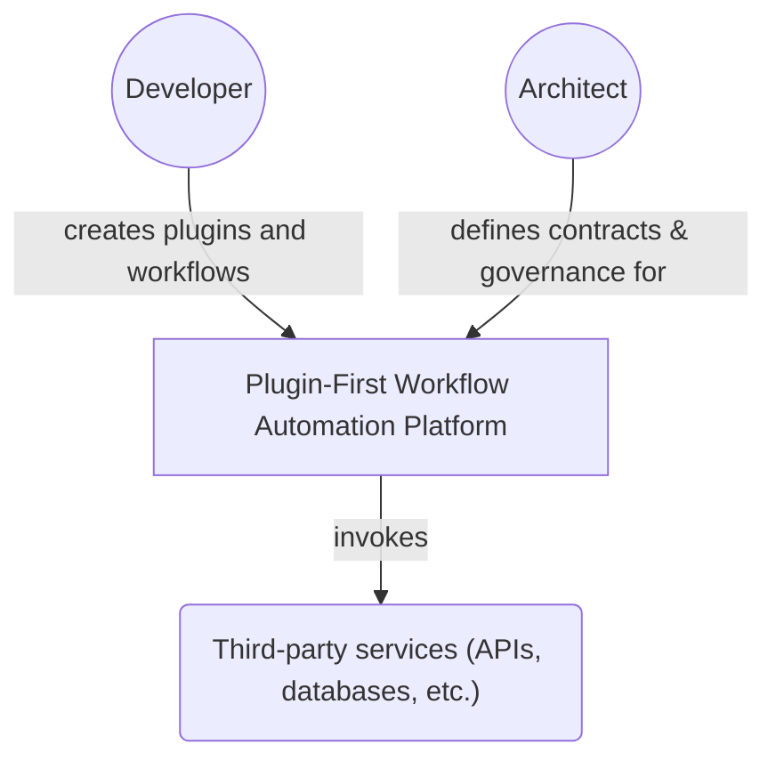

# C4 Model Level 0 - System Context Diagram

```mermaid
flowchart TD
    %% Actors
    dev((Developer))
    arch((Architect))

    %% System Boundary
    pfa["Plugin-First Workflow Automation Platform"]

    %% External Systems
    ext("Third-party services (APIs, databases, etc.)")

    %% Relationships
    dev -->|creates plugins and workflows| pfa
    arch -->|defines contracts & governance for| pfa
    pfa -->|invokes| ext
```
