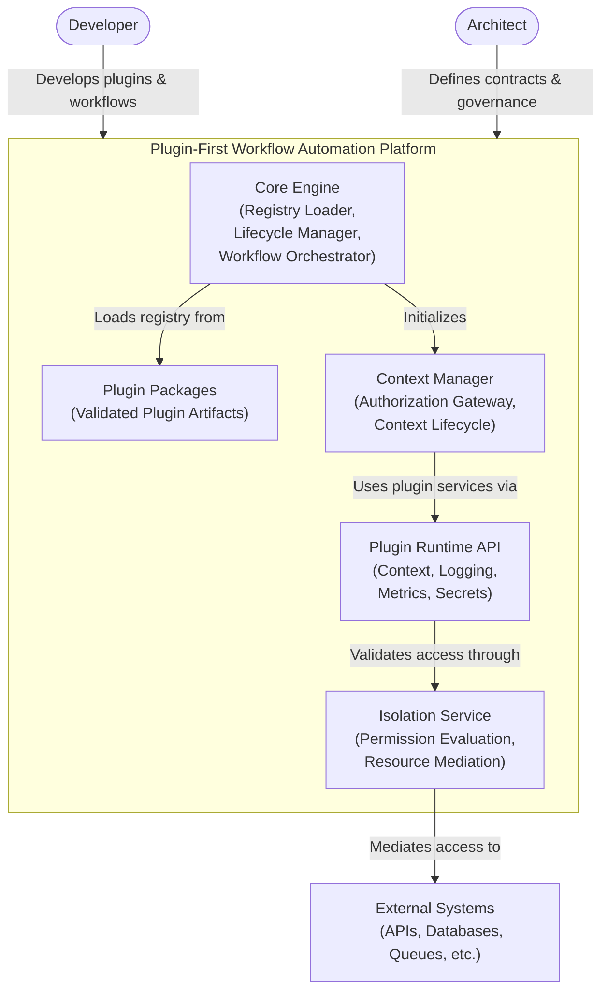

# C4 Model Level 1 - Container Diagram (Flowchart)

```mermaid
flowchart TD

    Dev([Developer])
    Arch([Architect])

    subgraph PFA["Plugin-First Workflow Automation Platform"]

        CE["Core Engine
        (Registry Loader,
        Lifecycle Manager,
        Workflow Orchestrator)"]

        PP["Plugin Packages
        (Validated Plugin Artifacts)"]

        CM["Context Manager
        (Authorization Gateway,
        Context Lifecycle)"]

        RA["Plugin Runtime API
        (Context, Logging,
        Metrics, Secrets)"]

        IS["Isolation Service
        (Permission Evaluation,
        Resource Mediation)"]

    end

    EXT["External Systems
    (APIs, Databases, Queues, etc.)"]

    Dev -->|Develops plugins & workflows| PFA
    Arch -->|Defines contracts & governance| PFA

    CE -->|Loads registry from| PP
    CE -->|Initializes| CM

    CM -->|Uses plugin services via| RA
    RA -->|Validates access through| IS
    IS -->|Mediates access to| EXT
```
