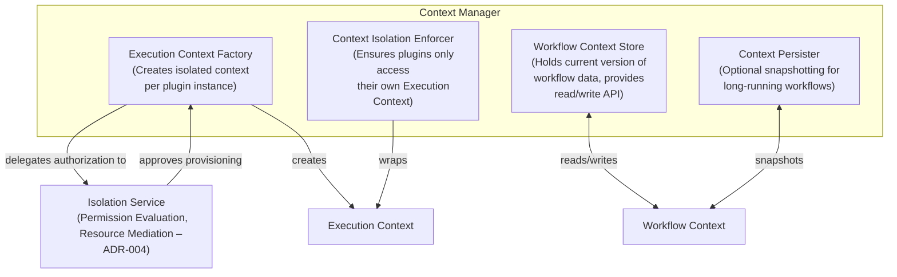

# C4 Level 2 – Context Manager Component Diagram

This diagram shows the internal building blocks of the **Context Manager** container and their relationships.

**Referenced ADRs:** ADR-004 (Plugin Isolation Model), ADR-006 (Execution Context), ADR-007 (Workflow Context).

