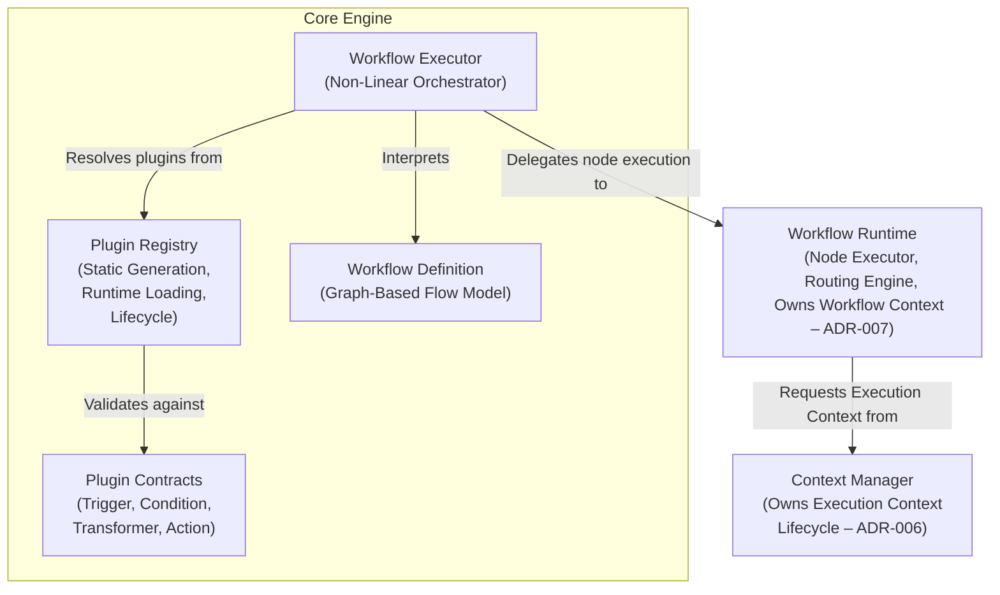

# C4 Level 2 – Core Engine Component Diagram

This diagram shows the internal building blocks of the **Core Engine** container and their dependencies.

**Referenced ADRs:** ADR-001 (Core Minimalism), ADR-002 (Plugin Registration), ADR-005 (Plugin Contract Model).

**External dependencies shown:** Context Manager (ADR-006), Workflow Runtime (ADR-007).

