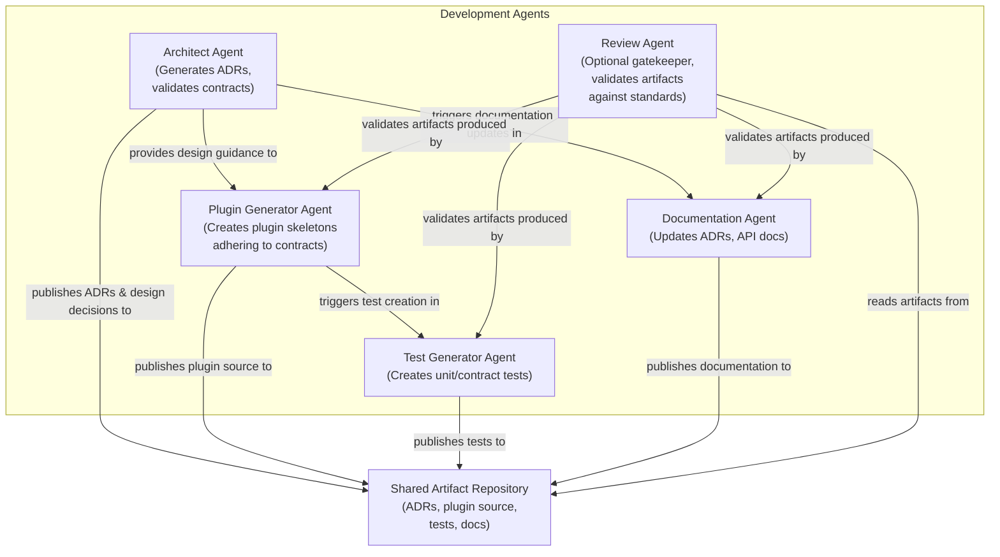

# C4 Level 2 – Development Agents Component Diagram

This diagram shows the internal structure of the **Development Agents** layer and how agents collaborate via a shared artifact repository.

**Referenced ADRs:** ADR-008 (Agent-Assisted Development Model).

## Verification

| Check | Result |
|-------|--------|
| All five agents from the description are present | ✅ |
| Shared Artifact Repository included | ✅ |
| Interactions via shared artifact repository shown | ✅ |
| Review Agent marked as optional | ✅ |
| Consistent with ADR-008 agent hierarchy and collaboration model | ✅ |
| No runtime components included (per ADR-008 separation principle) | ✅ |
| Mermaid syntax valid | ✅ |
