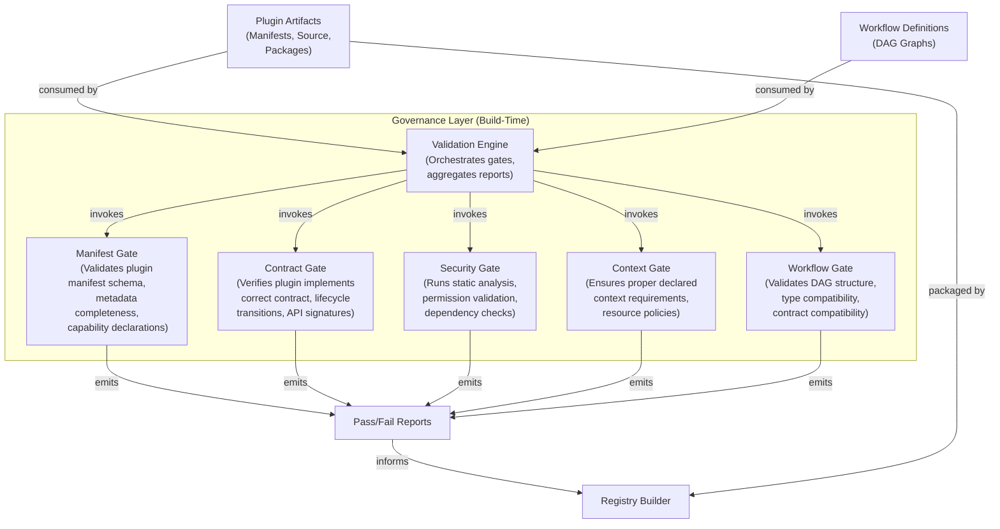

# C4 Level 2 – Governance Layer Component Diagram

This diagram shows the internal building blocks of the **Governance Layer** (build‑time validation gates) and their relationships to plugin artifacts.

**Referenced ADRs:** ADR-009 (Governance & Validation Framework).

## Component Summary

| Component | Responsibility | ADR Reference |
|-----------|---------------|---------------|
| Validation Engine | Orchestrates all gates, distributes artifacts, aggregates pass/fail reports | ADR-009 |
| Manifest Gate | Schema validation, metadata completeness, capability declaration validation | ADR-002, ADR-009 |
| Contract Gate | Plugin Contract Model compliance, lifecycle state transitions, API signature verification | ADR-003, ADR-005, ADR-009 |
| Security Gate | Permission-capability alignment, package isolation compliance, static analysis | ADR-004, ADR-009 |
| Context Gate | Declared context requirement validation, resource policy well-formedness, execution model compatibility | ADR-006, ADR-009 |
| Workflow Gate | DAG validation, type/contract compatibility across nodes, plugin existence checks | ADR-007, ADR-009 |

## Notes

- The Governance Layer operates **exclusively at build time** (CI/CD pipeline) and is **not** deployed as a runtime service (per ADR-009).
- A failure in any gate blocks artifact inclusion in the generated Static Registry.
- No gate can be bypassed via configuration or direct injection.
