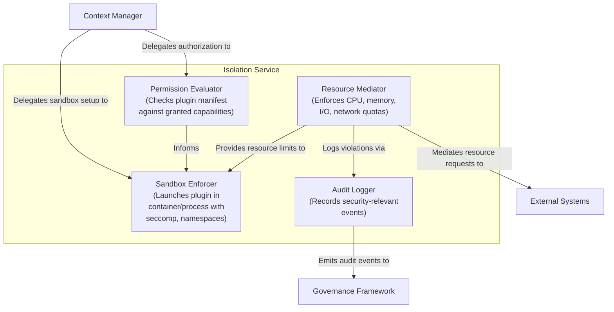

# C4 Level 2 – Isolation Service Component Diagram

This diagram shows the internal building blocks of the **Isolation Service** container and their relationships.

**Referenced ADRs:** ADR-004 (Plugin Isolation Model), ADR-009 (Build-time Validation – declares permissions enforced at runtime by this service).

