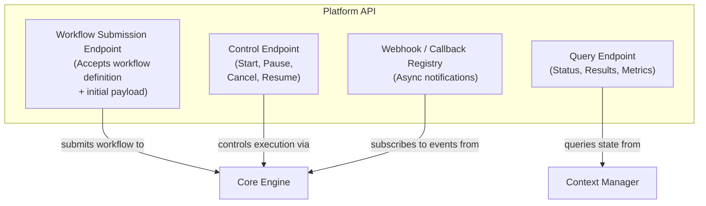

# C4 Level 2 – Platform API Component Diagram

This diagram shows the internal building blocks of the **Platform API** container and their dependencies.

**Referenced ADRs:** ADR-001 (Core Minimalism), ADR-007 (Workflow Graph Specification).

## Notes

- **No runtime validation hook**: ADR-009 validation is strictly build-time (CI/CD). Request-level input validation (e.g., payload schema) is an implementation detail, not an architectural component.
- **Core Engine as intermediary**: Per ADR-001, the Core Engine orchestrates workflows. The Platform API routes through it rather than directly to the Workflow Runtime.
- **Context Manager for queries**: Aligns with the Level-1 container diagram; the Context Manager owns context lifecycle and exposes runtime state.
- **Webhook / Callback Registry**: Included per requirements but not yet covered by a formal ADR. Subscribes to Core Engine events for async notifications.
