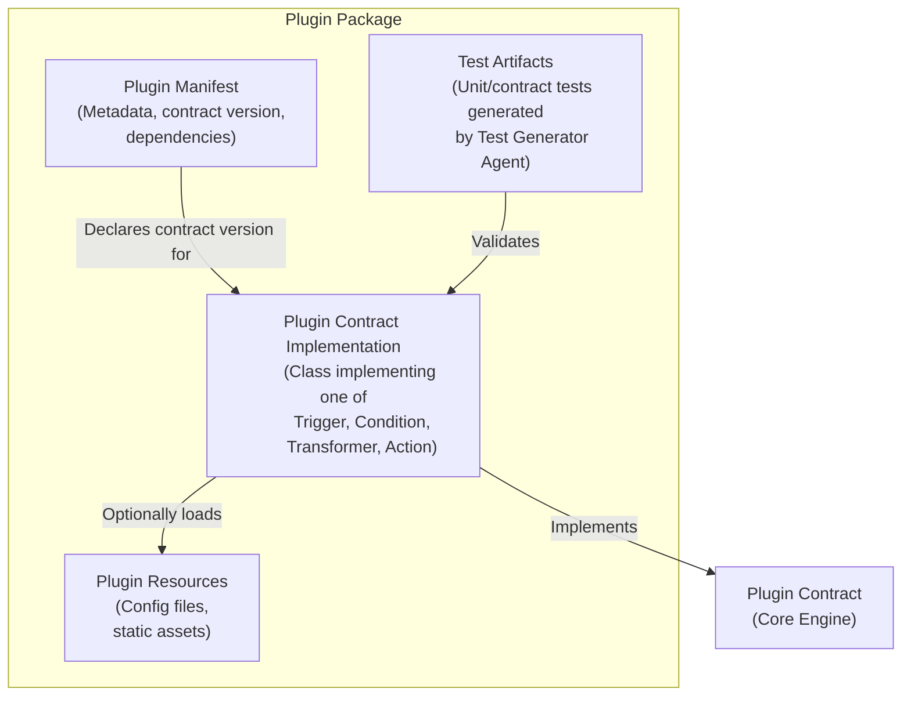

# C4 Level 2 – Plugin Packages Component Diagram

This diagram shows the internal structure of a validated **Plugin Package** artifact stored in the Plugin Registry.

**Referenced ADRs:** ADR-002 (Plugin Registration Model), ADR-005 (Plugin Contract Model).

