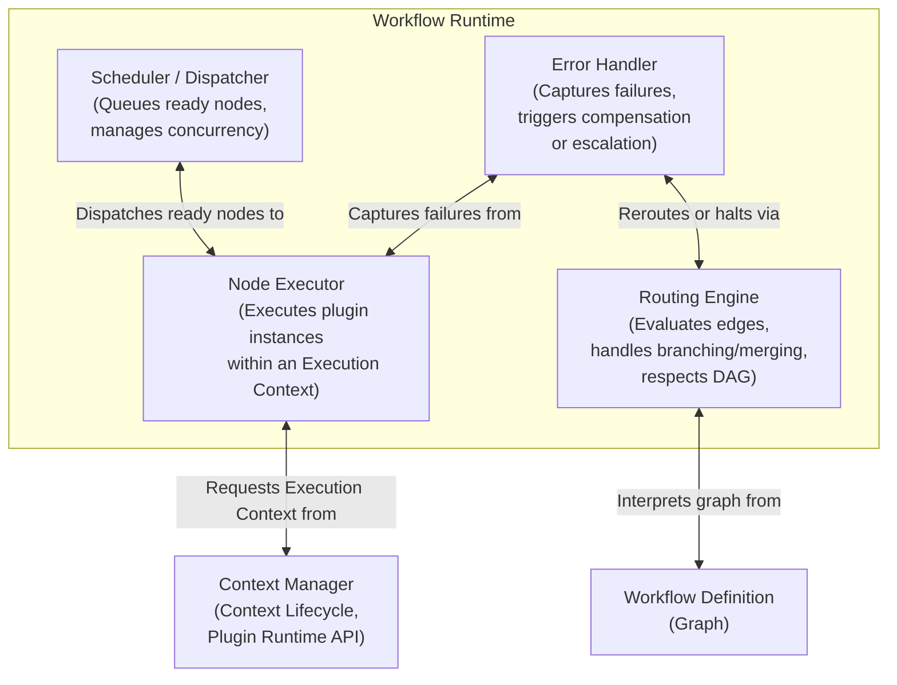

# C4 Level 2 – Workflow Runtime Component Diagram

This diagram shows the internal building blocks of the **Workflow Runtime** container and their dependencies.

**Referenced ADRs:** ADR-006 (Execution Context), ADR-007 (Workflow Graph Specification).

