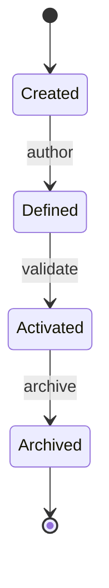
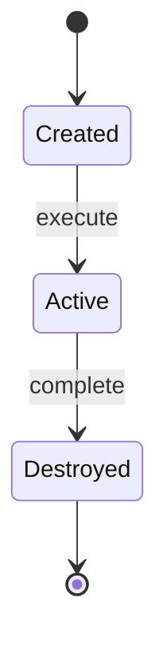
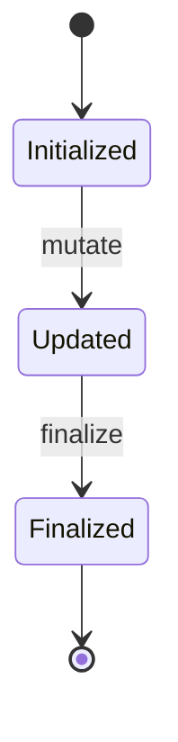

# Domain Model

This document outlines the domain model and lifecycle management of the agentic-workflow-automation-platform. It details core concepts, component relationships, and state transitions for workflows, plugins, and execution contexts. Intended for developers and architects implementing or maintaining the platform's architecture.

## Core Concepts

### Workflow
A workflow represents the definition of a process to be automated. It specifies the sequence and conditions under which different types of processing steps should occur. Workflows are declarative descriptions that can be reused across multiple executions.

### Plugin
A plugin is an encapsulated unit of processing logic that performs a specific function within a workflow. Plugins are independent components that can be developed, tested, and deployed separately.

### Plugin Types
Different types of plugins serve distinct roles in workflow processing:
- **Triggers** initiate workflow execution in response to events or conditions
- **Conditions** evaluate data to determine processing paths
- **Transformers** modify data as it flows through the workflow
- **Actions** perform external operations or produce outcomes

### Execution Context
The **Execution Context** is a per‑plugin‑instance isolation boundary. Each plugin execution receives its own isolated context that provides memory, threading, and sandbox scopes. It exists only for the duration of that plugin's execution and is not shared with other plugins.

### Workflow Context
The **Workflow Context** is a mediated data‑propagation container managed by the workflow runtime. It carries state through the workflow graph, mapping node outputs to subsequent node inputs. Plugins read from and write to the Workflow Context, but never exchange data directly.

### Workflow Execution
A workflow execution is a specific instance of running a workflow with particular input data. It represents the actual processing that occurs when a workflow is activated.

### Plugin Registry
The plugin registry is a system component that manages available plugins, making them discoverable and ensuring they meet required standards before use.


## Relationships (Conceptual)
- **Workflow ↔ Plugin**: A Workflow *composes* Plugins into a directed graph; each Plugin is referenced by ID and position. The Workflow owns the topology, while Plugins remain unaware of the graph.
- **Plugin ↔ Execution Context**: A Plugin *consumes* its own isolated Execution Context for the duration of its execution. The context provides sandboxed resources and is discarded after the plugin completes.
- **Plugin ↔ Workflow Context**: A Plugin reads required inputs from the Workflow Context and writes its outputs back to it, enabling mediated data propagation without direct state sharing.
- **Workflow Execution ↔ Workflow**: A Workflow Execution is a *runtime instance* of a Workflow definition. It materializes the graph with concrete input data and tracks progression.
- **Workflow Execution ↔ Workflow Context**: The Workflow Execution manages a single Workflow Context that is passed through the graph. Each plugin reads from and writes to this context, while its own Execution Context remains isolated.
- **Plugin Registry ↔ Workflow**: Workflows can only reference Plugins that are registered and validated in the Plugin Registry.
- **Plugin ↔ Plugin**: Plugins *never interact directly*. Dependencies are expressed through Context data requirements. This ensures isolation and testability.


## Lifecycles
Workflow:
- Created: Workflow definition is authored
- Defined: Workflow structure is validated against standards
- Activated: Workflow is ready to accept executions
- Archived: Marked as static (no longer modified)



Plugin:
 - Registered: Plugin is registered in the plugin registry
 - Activated: Plugin is activated and ready for execution
 - Active: Plugin is executing its function
 - Deactivated: Plugin is deactivated but still registered
 - Cleaned Up: Plugin resources are cleaned up and removed from active management

 ```mermaid
 stateDiagram-v2
     [*] --> Registered
     Registered --> Activated: activate
     Activated --> Active: execute
     Active --> Deactivated: deactivate
     Deactivated --> Cleaned Up: cleanup
     Cleaned Up --> [*]

Execution Context:
- Created: Created for a specific plugin execution
- Active: Plugin is executing within this context
- Destroyed: Context is destroyed after plugin completes (or on error)



Workflow Context:
- Initialized: Created at workflow start with initial input
- Updated: Modified by a plugin (each plugin reads and writes, creating a new version for the next)
- Finalized: Persisted as the workflow execution result



Workflow Execution:
- Pending: Waiting for execution start
- Running: Actively processing plugins
- Completed: All plugins successfully executed
- Failed: Execution aborted with error
- Compensating: Failed plugins trigger recovery logic


## Conceptual Responsibilities
- **Workflow**: Owns the structure and flow logic; defines valid execution paths
- **Plugin**: Owns specific processing behavior; operates independently
- **Execution Context**: Owns data integrity during transit; provides state management
- **Workflow Execution**: Owns runtime instance state; tracks progress and results
- **Plugin Registry**: Owns plugin availability; ensures quality and compatibility
- **Governance Gate**: Owns architectural compliance; enforces constraints

## Guiding Principles
- Processing logic resides exclusively in plugins
- The core system orchestrates without containing business logic
- Data flows through the system via well-defined context mechanisms
- Plugin interactions are mediated to maintain isolation and predictability
- System behavior follows consistent patterns that enable reliable automation
