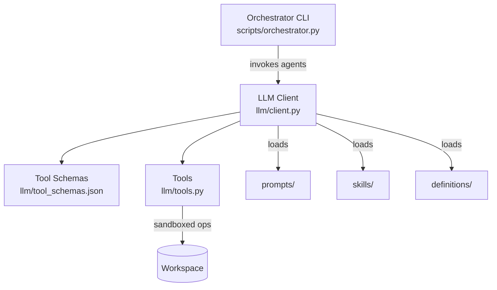
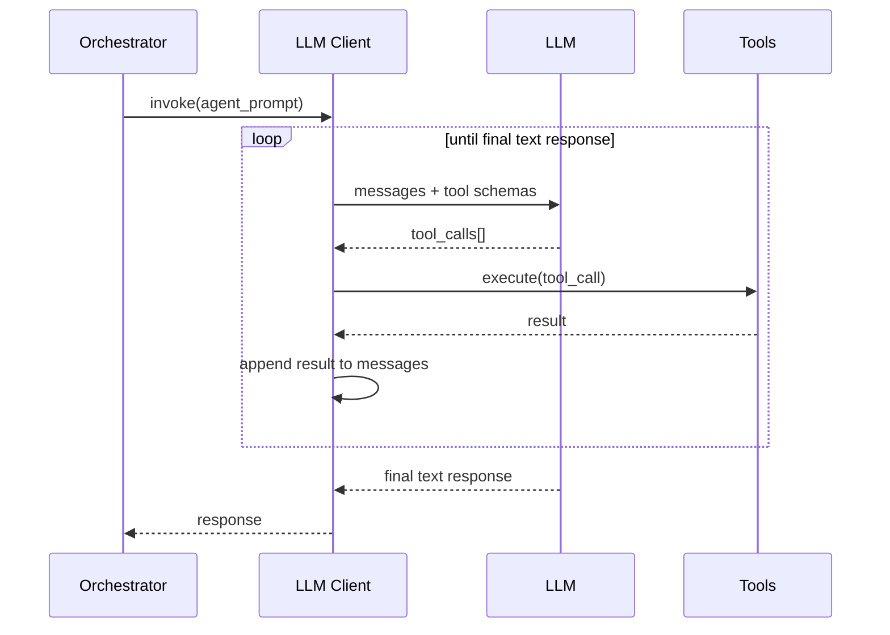

# Agents

Agentic development infrastructure for the autonomous development pipeline (ADR-008).

This module provides the runtime infrastructure that enables AI agents to autonomously design, implement, test, and review code. It is **not** the agents themselves—it is the tooling, prompts, skills, and definitions that power them.

> Each subdirectory contains its own `README.md` with detailed documentation.

## Structure

| Directory | Purpose | Details |
|-----------|---------|---------|
| [`llm/`](llm/README.md) | LLM client with agentic tool-calling loop, tool implementations, and schemas | Provider-agnostic client (OpenRouter, Ollama, OpenAI-compatible) |
| [`prompts/`](prompts/README.md) | Per-agent system prompts injected as the first message in LLM conversations | Architect, Developer, Planner, Reviewer, Tester |
| [`skills/`](skills/README.md) | Skill documentation referenced by prompts for domain-specific guidance | ADR writing, code review, file ops, test generation |
| [`definitions/`](definitions/README.md) | Agent role definitions describing responsibilities, inputs, outputs, and constraints | One file per agent role |

## How It Fits Together

1. The **Orchestrator** invokes an agent by selecting its system prompt and passing a user message.
2. The **LLM Client** sends the prompt + message to the LLM provider with tool schemas attached.
3. The LLM responds with tool calls (read/write files, run commands) or a final text response.
4. **Tools** execute sandboxed operations against the workspace.
5. The loop repeats until the agent produces its final output.

## Tool-Calling Loop

## Agent Roles

| Agent | Responsibility |
|-------|---------------|
| **Orchestrator** | Coordinates the pipeline, invokes agents in sequence |
| **Architect** | Validates requirements against ADRs, produces design guidance |
| **Planner** | Breaks requirements into task files with acceptance criteria |
| **Developer** | Implements code using tool-calling (read/write/run) |
| **Tester** | Writes and runs tests, measures coverage |
| **Reviewer** | Reviews implementation against requirements and standards |

## Security & Sandboxing

All agent interactions are sandboxed:

- **Write restrictions** — Only `src/`, `tests/`, `docs/` directories are writable
- **Command allowlist** — Only `ruff`, `mypy`, `pytest`, and read-only shell commands are permitted
- **Path traversal prevention** — All paths resolved against workspace root
- **Iteration cap** — 20-iteration maximum prevents infinite tool loops
- **Timeout** — 120s subprocess timeout prevents hangs

## Configuration

The LLM client is configured via environment variables (`LLM_API_KEY`, `LLM_BASE_URL`, `LLM_MODEL`, etc.). See [`llm/README.md`](llm/README.md) for the full configuration reference.

## Key ADRs

- **ADR-008** — Agentic Development: defines the agent-driven lifecycle and governance model
- **ADR-009** — Build-Time Governance: pipeline guards that validate agent outputs
