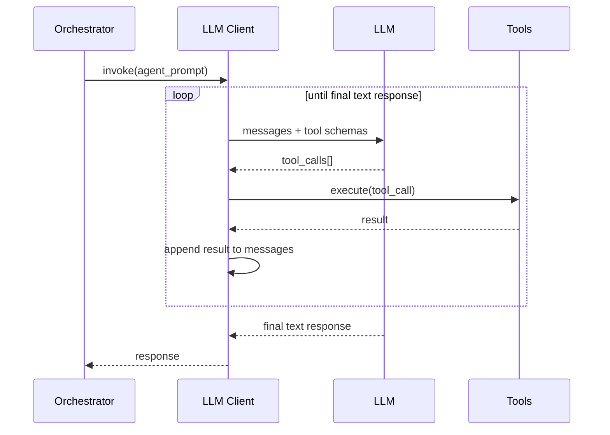

# Agents

Agentic development infrastructure for the autonomous development pipeline (ADR-008).

## Structure

| Directory | Purpose |
|-----------|---------|
| `llm/` | LLM client with tool-calling loop (`client.py`), tool implementations (`tools.py`), and schemas |
| `prompts/` | Per-agent system prompts (architect, developer, planner, reviewer, tester) |
| `skills/` | Skill documentation referenced by prompts (ADR writing, code review, file ops, test generation) |
| `definitions/` | Agent role definitions and responsibilities |

## Tool-Calling Loop

Tools are sandboxed: writes restricted to `src/`, `tests/`, `docs/`; commands allowlisted; path traversal blocked.

## Key ADR

- **ADR-008** — Agentic Development
