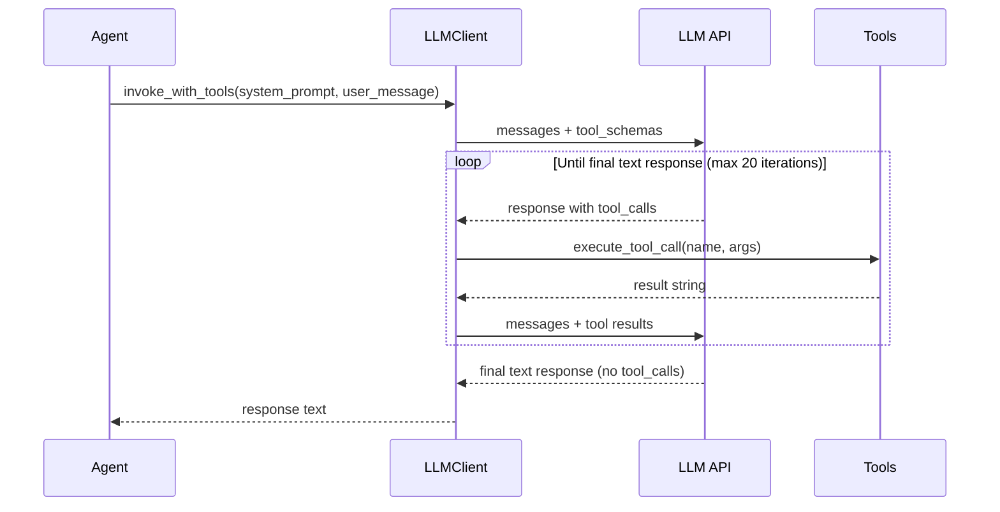

# LLM Client

LLM integration layer implementing the agentic tool-calling loop. This module provides a provider-agnostic client that works with any OpenAI-compatible API (OpenRouter, Ollama, vLLM, OpenAI) and enables agents to iteratively invoke tools until they produce a final text response.

## Modules

| Module | Purpose |
|--------|---------|
| `client.py` | LLM client — sends messages, handles tool calls in a loop until final response |
| `tools.py` | Tool implementations (read/write files, list dirs, run commands) with sandboxing |
| `tool_schemas.json` | JSON schemas describing available tools for the LLM |

## Architecture

The module implements an **agentic tool-calling loop**:



## Configuration

All configuration is via environment variables:

| Variable | Default | Description |
|----------|---------|-------------|
| `LLM_API_KEY` | *(required)* | API key for the LLM provider |
| `LLM_BASE_URL` | `https://openrouter.ai/api/v1` | Base URL of the API endpoint |
| `LLM_MODEL` | `openrouter/free` | Model identifier |
| `LLM_MAX_TOKENS` | `4096` | Maximum response tokens per call |
| `LLM_TEMPERATURE` | `0.3` | Sampling temperature |
| `LLM_MAX_RETRIES` | `3` | Max retries for empty/failed responses |
| `LLM_RETRY_DELAY` | `2.0` | Initial retry delay (seconds) |
| `LLM_RETRY_BACKOFF` | `2.0` | Backoff multiplier per retry |
| `LLM_TIMEOUT` | `120` | Request timeout (seconds) |
| `WORKSPACE_ROOT` | `cwd()` | Workspace root for tool path resolution |

## Usage

### Single-Shot Invocation

```python
from src.agents.llm import LLMClient

client = LLMClient()
response = client.invoke(
    system_prompt="You are a helpful assistant.",
    user_message="Explain DAGs in 2 sentences.",
)
```

### Agentic Tool-Calling Loop

```python
from pathlib import Path
from src.agents.llm import LLMClient, load_system_prompt

client = LLMClient()
system_prompt = load_system_prompt("developer")

response = client.invoke_with_tools(
    system_prompt=system_prompt,
    user_message="Create a TimerTrigger plugin following existing patterns.",
    workspace=Path("/path/to/project"),
)
```

The agent will autonomously read files, explore the project structure, write implementation code, and run validation commands before producing its final response.

### Parsing JSON Responses

```python
from src.agents.llm import parse_json_response

raw = '```json\n{"status": "approved", "findings": []}\n```'
data = parse_json_response(raw)  # {"status": "approved", "findings": []}
```

Handles both fenced markdown JSON blocks and raw JSON strings.

## Available Tools

Agents can invoke four tools during the tool-calling loop:

### `read_file`
Read file contents relative to workspace root. Files over 50K characters are truncated.

### `write_file`
Create or overwrite files. Restricted to `src/`, `tests/`, and `docs/` directories. Automatically:
- Creates parent directories
- Validates Python syntax via `ast.parse`
- Tracks created vs. modified files for pipeline guards

### `list_directory`
List directory contents (excludes hidden files, `__pycache__`, `node_modules`, `.git`).

### `run_command`
Execute allowlisted shell commands. Permitted prefixes:
- `uv run ruff` / `ruff` — linting
- `uv run mypy` / `mypy` — type checking
- `uv run pytest` / `pytest` — testing
- `cat`, `head`, `tail`, `find`, `ls`, `grep` — file inspection

Commands timeout after 120 seconds. For pytest commands, `.env.test` overrides are loaded automatically.

## Security & Sandboxing

| Constraint | Enforcement |
|------------|-------------|
| Path traversal prevention | All paths resolved against workspace; `is_relative_to` check |
| Write restrictions | Only `src/`, `tests/`, `docs/` prefixes allowed |
| Command allowlist | Only whitelisted command prefixes execute |
| Timeout | 120s subprocess timeout prevents hangs |
| Max iterations | 20-iteration cap prevents infinite tool loops |

## Error Handling

| Error Class | When Raised |
|-------------|-------------|
| `LLMConfigError` | Missing `LLM_API_KEY` at initialization |
| `LLMError` | API failures after retries, empty responses after retries, max iterations exceeded |

The client includes:
- **Exponential backoff** on transient API errors
- **Empty response recovery** — nudges the model to continue
- **Truncation handling** — detects `finish_reason=length` and asks the model to continue
- **JSON repair** — attempts to fix truncated `write_file` arguments by closing unterminated strings

## File Tracking

The tools module tracks files created and modified during a session:

```python
from src.agents.llm.tools import get_written_files, get_modified_files

get_written_files()   # New files created this session
get_modified_files()  # Existing files overwritten this session
```

These lists are used by pipeline guards to verify that agents actually produced the artifacts they claim to have created.

## System Prompts

System prompts are loaded from `src/agents/prompts/{agent_name}_system_prompt.md`:

```python
from src.agents.llm import load_system_prompt

prompt = load_system_prompt("developer")  # loads developer_system_prompt.md
```
