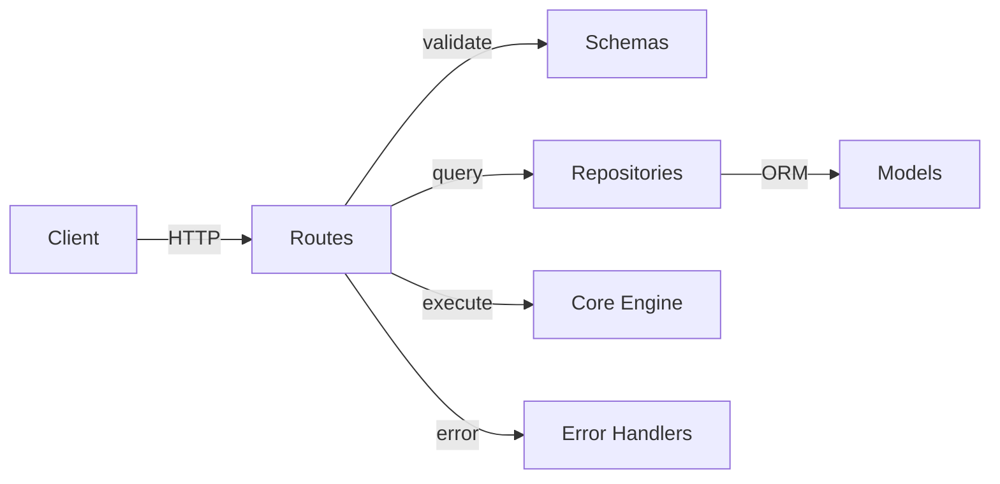

# API Layer

FastAPI application providing the HTTP interface for workflow management and execution.

## Structure

| Path | Purpose |
|------|---------|
| `main.py` | FastAPI app factory, middleware, and lifespan |
| `routes/` | Route handlers (workflows, plugins, executions) |
| `schemas/` | Pydantic request/response models |
| `errors/` | Exception handlers and error response formatting |

## Endpoints

- `POST /workflows/` — Create a workflow definition
- `GET /workflows/{id}` — Retrieve a workflow
- `POST /workflows/{id}/execute` — Execute a workflow with initial data
- `GET /executions/{id}` — Get execution status and results

## Request Flow



## Running

```bash
uv run uvicorn src.api.main:app --reload
```

Docs available at `http://localhost:8000/docs`.
