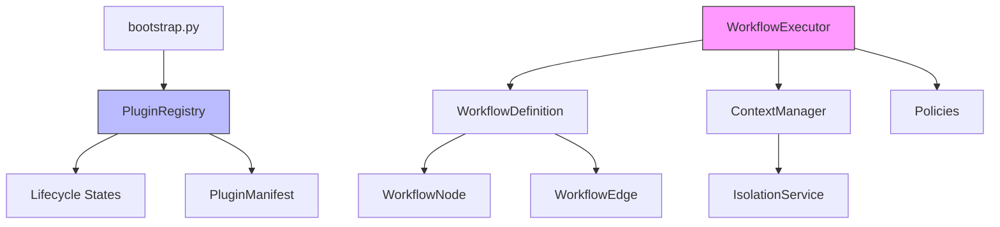
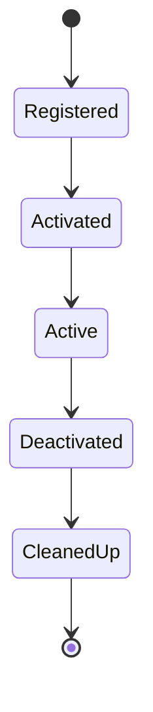

# Core Engine

Plugin contracts, registry, lifecycle management, and workflow orchestration.

## Modules

| Module | Purpose |
|--------|---------|
| `contracts.py` | Abstract base classes for plugin types (Trigger, Condition, Transformer, Action) |
| `registry.py` | Plugin registry with lifecycle state management (ADR-002, ADR-003) |
| `registration.py` | `@register_plugin` decorator and build-time collection |
| `manifest.py` | `PluginManifest` model with port schemas and metadata |
| `workflow.py` | `WorkflowDefinition`, `WorkflowNode`, `WorkflowEdge` DAG models |
| `executor.py` | `WorkflowExecutor` — runs the DAG respecting dependencies and policies |
| `context.py` | `ExecutionContext` and `ContextManager` for per-instance isolation (ADR-006) |
| `isolation.py` | `IsolationService` — sandbox enforcement for plugin execution |
| `policies.py` | Retry, timeout, and error-handling strategies per node |
| `bootstrap.py` | Application startup: loads registry, activates plugins |

## Architecture

## Key ADRs

- **ADR-001** — Core Minimalism
- **ADR-002** — Static Plugin Registration
- **ADR-003** — Plugin Lifecycle States
- **ADR-006** — Execution Context Isolation
- **ADR-007** — Composable DAG Workflows
