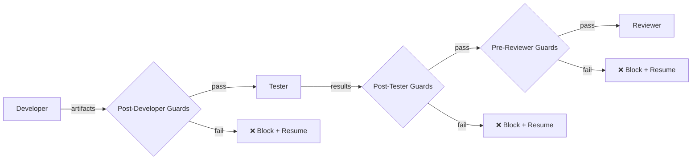

# Governance

Build-time validation framework (ADR-009) and pipeline guards for the agentic development process.

## Modules

| Module | Purpose |
|--------|---------|
| `gates.py` | Five validation gates: Manifest, Contract, Security, Context, Workflow |
| `engine.py` | `ValidationEngine` — runs gates and produces `ValidationReport` |
| `pipeline_guards.py` | Post-step guards that prevent hallucinated implementations from advancing |
| `pipeline_errors.py` | `PipelineGateError` raised when a guard fails |

## Validation Gates

1. **ManifestValidationGate** — Validates plugin manifest completeness
2. **ContractValidationGate** — Ensures plugins conform to their declared contracts
3. **SecurityValidationGate** — Checks for security policy violations
4. **ExecutionContextValidationGate** — Verifies isolation boundaries
5. **WorkflowValidationGate** — Validates DAG structure and edge compatibility

## Pipeline Guards

- **Post-Developer**: artifact existence, path validation, syntax check
- **Post-Tester**: runs `pytest`, measures coverage
- **Pre-Reviewer**: report-to-git consistency

## Key ADR

- **ADR-009** — Build-Time Governance
