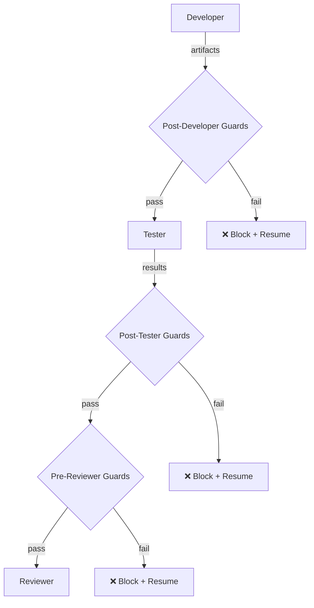
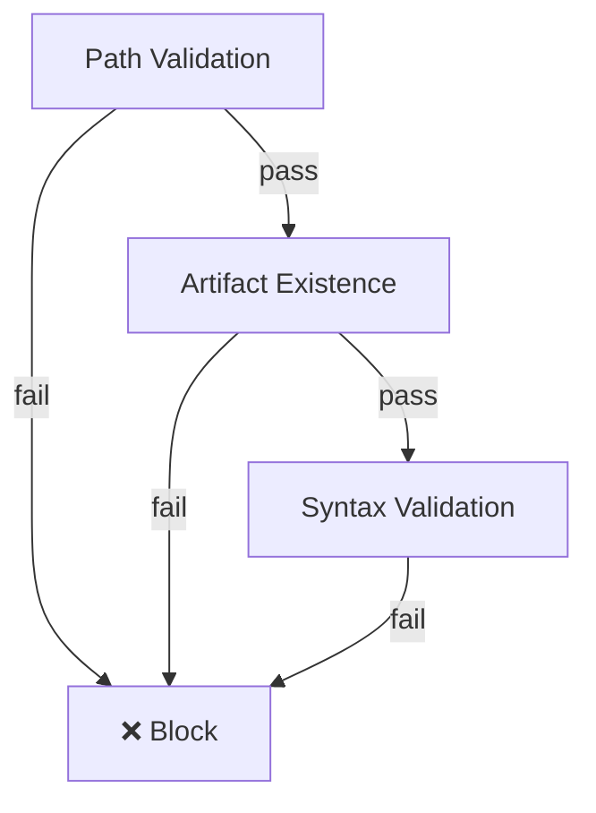
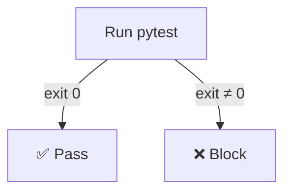
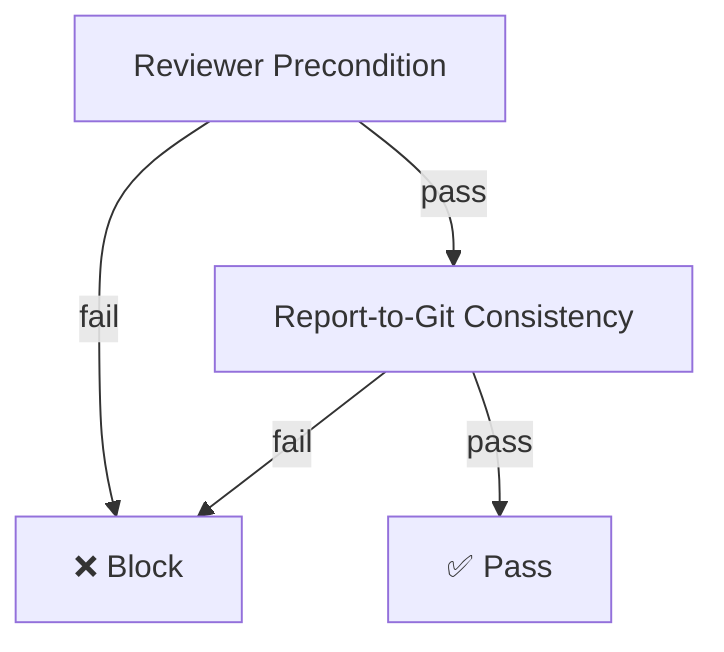

# Governance

Build-time validation framework (ADR-009) and pipeline guards for the agentic development process.

This module enforces two layers of quality control:
1. **Validation Gates** — Build-time checks that prevent invalid plugins and workflows from entering the registry.
2. **Pipeline Guards** — Runtime checks between orchestrator steps that prevent phantom implementations from advancing.

## Modules

| Module | Purpose |
|--------|---------|
| `gates.py` | Five validation gates: Manifest, Contract, Security, Context, Workflow |
| `engine.py` | `ValidationEngine` — runs gates and produces `ValidationReport` |
| `pipeline_guards.py` | Post-step guards that prevent hallucinated implementations from advancing |
| `pipeline_errors.py` | `PipelineGateError` raised when a guard fails |

## Validation Gates

Each gate implements the `ValidationGate` abstract base class and returns a list of error strings (empty = pass).

### 1. ManifestValidationGate

Validates plugin manifest schema and metadata completeness (ADR-002).

**Checks:**
- `name` is not empty or blank
- `version` follows semver format (`X.Y.Z`)
- `plugin_type` is declared

### 2. ContractValidationGate

Verifies plugin contract compliance (ADR-003, ADR-005).

**Checks:**
- Plugin subclasses the correct contract type for its declared `plugin_type`:
  - `TRIGGER` → `TriggerPlugin`
  - `CONDITION` → `ConditionPlugin`
  - `TRANSFORMER` → `TransformerPlugin`
  - `ACTION` → `ActionPlugin`

### 3. SecurityValidationGate

Validates permission declarations and isolation compliance (ADR-004).

**Checks:**
- Permissions are not blank
- Permissions use `scope:resource` format (colon-separated)
- No duplicate permissions declared

### 4. ExecutionContextValidationGate

Validates declared execution context requirements (ADR-006).

**Checks:**
- `resource_requirements` in metadata is a dict (if present)
- `max_memory_mb` is a positive number
- `max_threads` is a positive integer
- `timeout_seconds` is a positive number

### 5. WorkflowValidationGate

Validates workflow DAG structure and plugin compatibility (ADR-007). Unlike other gates, this operates on an entire `WorkflowDefinition` rather than a single plugin.

**Checks:**
- All nodes reference plugins that exist in the registry
- Condition edge labels are valid (`true`/`false`)
- Condition-labeled edges originate only from `ConditionPlugin` nodes
- Edge source ports exist in the source plugin's declared outputs
- Edge target ports exist in the target plugin's declared inputs
- Data types are compatible across connected ports

## Validation Engine

The `ValidationEngine` orchestrates gate execution and produces `ValidationReport` objects.

**Key design rule:** Gates cannot be bypassed — all registered gates are executed for every artifact (ADR-009 mandatory rule).

### API Integration

The `ValidationEngine` is wired into the REST API to enforce governance at request time:

| Endpoint | Gates Applied | Behavior on Failure |
|----------|---------------|---------------------|
| `POST /plugins/` | Manifest, Security, ExecutionContext | Returns 422 with gate errors |
| `POST /workflows/` | Workflow (port compatibility, plugin existence, condition labels) | Returns 422 with gate errors |

The `ContractValidationGate` is skipped for API-based plugin registration because the API receives only manifest metadata, not a live plugin class. Contract validation applies at build-time when actual plugin classes are available.

### Usage

```python
from src.governance import ValidationEngine

engine = ValidationEngine()

# Validate a plugin
report = engine.validate_plugin(my_plugin)
if not report.passed:
    print(report.errors)

# Validate a workflow
report = engine.validate_workflow(workflow_def, registered_plugins)
if not report.passed:
    print(report.errors)
```

### Report Structure

```python
ValidationReport(
    artifact_name="my-plugin",
    gate_results=[
        GateResult(gate_name="Manifest Validation Gate", result="passed", errors=[]),
        GateResult(gate_name="Contract Validation Gate", result="failed", errors=[...]),
    ]
)
```

- `report.passed` — `True` if all gates passed
- `report.errors` — Aggregated list of all error messages

## Pipeline Guards

Pipeline guards run between orchestrator steps to prevent phantom implementations, hallucinated test coverage, and inconsistent reports from advancing.



### Guard Priority Levels

| Priority | Category | Guards |
|----------|----------|--------|
| **P0** | Critical — blocks pipeline | Artifact existence, Test execution |
| **P1** | Important — consistency | Report-to-git consistency, Reviewer precondition |
| **P2** | Quality — validation | Syntax validation, Path normalization |
| **P3** | Structural — output format | Structured output validation (via Pydantic in orchestrator) |

### Post-Developer Guards

Run after the Developer agent completes. Guards execute in dependency order:



1. **Path Validation** (`verify_paths_valid`) — Ensures paths are within project boundaries, detects traversal attacks, validates allowed prefixes (`src/`, `tests/`, `migrations/`, `scripts/`, `docs/`), and catches ambiguous paths resolving to the same location.
2. **Artifact Existence** (`verify_artifacts_exist`) — Verifies every claimed file actually exists on disk. Only runs if path validation passes.
3. **Syntax Validation** (`verify_syntax`) — Parses all Python files with `ast.parse` to catch syntax errors. Only runs if files exist.

### Post-Tester Guards

Run after the Tester agent completes:



1. **Test Execution** (`verify_tests_pass`) — Actually runs `pytest` and verifies exit code 0. Loads `.env.test` overrides to prevent external dependencies.

### Pre-Reviewer Guards

Run before the Reviewer agent starts:



1. **Reviewer Precondition** (`verify_reviewer_precondition`) — Ensures real source files exist for the reviewer to inspect.
2. **Report-to-Git Consistency** (`verify_report_matches_git`) — Cross-references the implementation report against `git status` to detect phantom files and undocumented changes.

### Additional Utilities

| Function | Purpose |
|----------|---------|
| `measure_test_coverage` | Runs pytest with `--cov-report=json` and returns total coverage % |
| `check_linting` | Runs `ruff check` on specified files |
| `check_type_checking` | Runs `mypy` on specified files |

### Orchestrator Integration

The orchestrator uses `run_all_guards_for_step` as the main entry point:

```python
from src.governance import run_all_guards_for_step, PipelineGateError

failures = run_all_guards_for_step(
    step="developer",
    implementation={"files_created": [...], "files_modified": [...]},
    workspace=Path("/path/to/project"),
)

if failures:
    errors = [err for _, errs in failures for err in errs]
    raise PipelineGateError(step="developer", errors=errors)
```

### PipelineGateError

Raised when guards fail, carrying the step name and all error messages:

```python
try:
    # ... run guards
except PipelineGateError as e:
    print(e.step)    # "developer"
    print(e.errors)  # ["Claimed created file not found on disk: src/foo.py"]
```

## Key ADRs

| ADR | Topic |
|-----|-------|
| **ADR-002** | Plugin Manifest & Static Registry |
| **ADR-003** | Plugin Lifecycle States |
| **ADR-004** | Plugin Isolation & Security |
| **ADR-005** | Plugin Contract Model |
| **ADR-006** | Execution Context Isolation |
| **ADR-007** | Workflow DAG Structure |
| **ADR-009** | Build-Time Governance (primary) |
