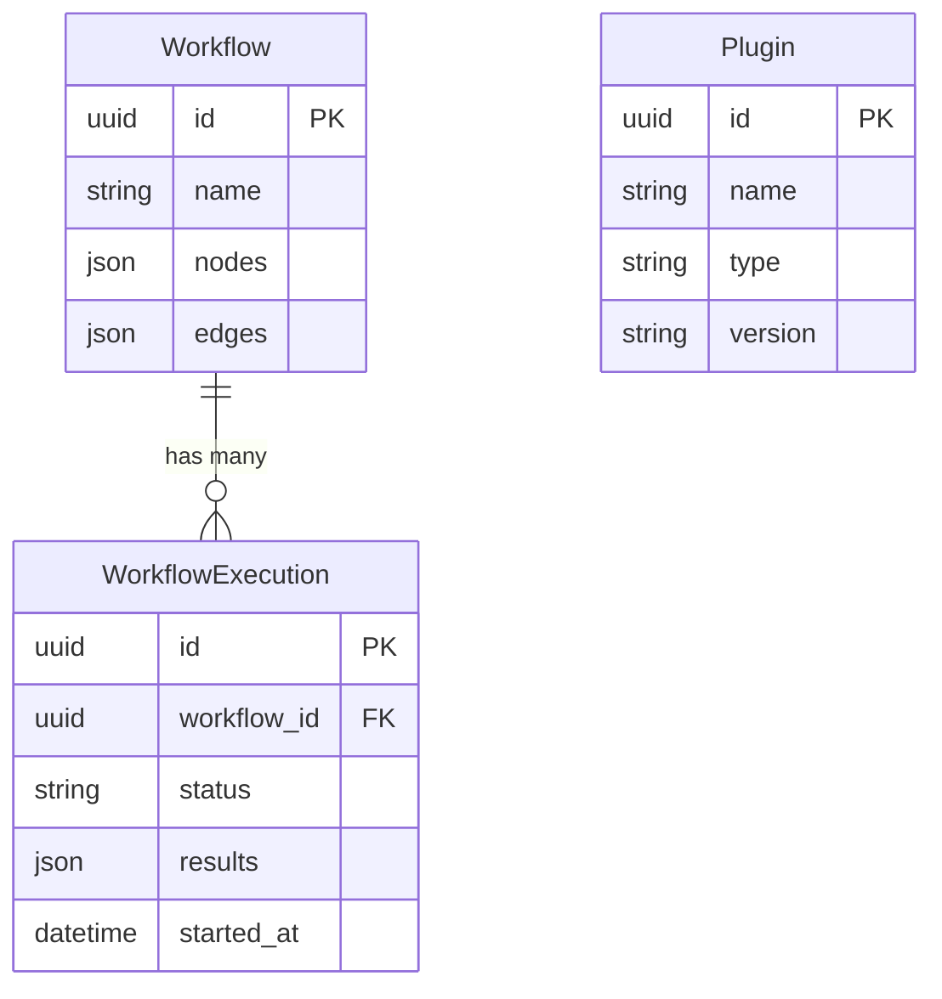

# Models

SQLModel ORM models for the persistence layer.

## Modules

| Module | Purpose |
|--------|---------|
| `workflow.py` | `Workflow` — persisted workflow definitions (nodes, edges, metadata) |
| `plugin.py` | `Plugin` — registered plugin records |
| `execution.py` | `WorkflowExecution` — execution history, status, and results |

## Entity Relationships

## Database

Models are managed via Alembic migrations (`migrations/`). The database engine is configured in `src/database.py` using the `DATABASE_URL` environment variable.
