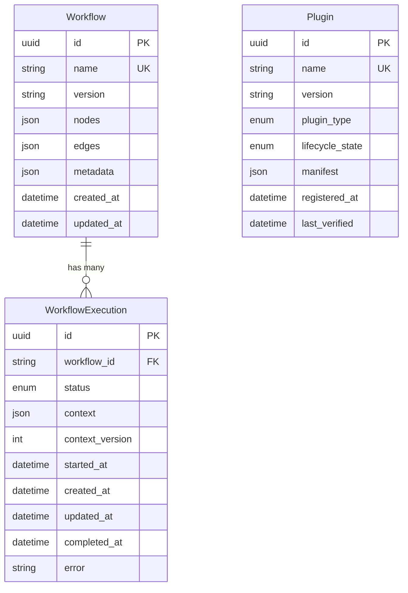

# Models

SQLModel ORM models for the persistence layer.

## Modules

| Module | Purpose |
|--------|---------|
| `workflow.py` | `Workflow` — persisted workflow definitions (nodes, edges, metadata) |
| `plugin.py` | `Plugin` — registered plugin records with lifecycle state |
| `execution.py` | `WorkflowExecution` — execution history, status, context, and results |
| `__init__.py` | Re-exports all models for convenient imports |

## Usage

```python
from src.models import Workflow, Plugin, WorkflowExecution
```

## Entity Relationships



## Model Details

### Workflow

Represents a persisted workflow definition. Nodes and edges define the DAG structure.

| Field | Type | Constraints | Description |
|-------|------|-------------|-------------|
| `id` | `UUID` | PK, auto-generated | Unique identifier |
| `name` | `str` | Unique, indexed, not null | Human-readable workflow name |
| `version` | `str` | Not null, default `"1.0.0"` | Semantic version of the definition |
| `nodes` | `list[dict]` | JSON column | Plugin references with per-node config |
| `edges` | `list[dict]` | JSON column | Directed edges defining data flow between nodes |
| `metadata_` | `dict` | JSON column (stored as `metadata`) | Additional workflow-level metadata |
| `created_at` | `datetime` | UTC, auto-set | Creation timestamp |
| `updated_at` | `datetime` | UTC, auto-set | Last modification timestamp |

**Node structure:**
```json
{"node_id": "trigger", "plugin_name": "manual-trigger", "config": {}}
```

**Edge structure:**
```json
{"source_node": "trigger", "source_port": "payload", "target_node": "action", "target_port": "data"}
```

### Plugin

Represents a registered plugin with its lifecycle state and manifest metadata.

| Field | Type | Constraints | Description |
|-------|------|-------------|-------------|
| `id` | `UUID` | PK, auto-generated | Unique identifier |
| `name` | `str` | Unique, indexed, not null | Plugin name |
| `version` | `str` | Not null | Semantic version |
| `plugin_type` | `PluginType` | Indexed, not null | Role classification (see below) |
| `lifecycle_state` | `LifecycleState` | Indexed, default `REGISTERED` | Current lifecycle state (see below) |
| `manifest` | `dict` | JSON column | Full plugin manifest metadata |
| `registered_at` | `datetime` | UTC, auto-set | When the plugin was first registered |
| `last_verified` | `datetime | None` | Nullable | Last successful verification timestamp |

**PluginType values:** `trigger`, `condition`, `transformer`, `action`

**LifecycleState values:** `registered` → `activated` → `active` → `deactivated` → `cleaned_up`

### WorkflowExecution

Tracks a single execution run of a workflow, including its status transitions and context snapshots.

| Field | Type | Constraints | Description |
|-------|------|-------------|-------------|
| `id` | `UUID` | PK, auto-generated | Unique identifier |
| `workflow_id` | `str` | Indexed, not null | Reference to the parent workflow |
| `status` | `ExecutionStatus` | Default `PENDING` | Current execution state |
| `context` | `dict` | JSON column | Workflow context data snapshot |
| `context_version` | `int` | Default `1` | Optimistic locking version counter |
| `started_at` | `datetime | None` | Nullable | When execution transitioned to RUNNING |
| `created_at` | `datetime` | UTC, auto-set | Record creation timestamp |
| `updated_at` | `datetime` | UTC, auto-set | Last update timestamp |
| `completed_at` | `datetime | None` | Nullable | When execution finished (success or failure) |
| `error` | `str | None` | Nullable | Error message if execution failed |

**ExecutionStatus values:**

| Status | Description |
|--------|-------------|
| `pending` | Created but not yet started |
| `running` | Currently executing |
| `completed` | Finished successfully |
| `failed` | Terminated with an error |

## Database

- Models are managed via Alembic migrations (`migrations/`).
- The database engine is configured in `src/database.py` using the `DATABASE_URL` environment variable.
- Tests use SQLite in-memory (no PostgreSQL required) via `conftest.py`.

## Design Notes

- All models use UUID primary keys for distributed-safe identity.
- JSON columns (`nodes`, `edges`, `context`, `manifest`) store structured data without requiring join tables, keeping queries simple for the DAG-based domain.
- `context_version` on `WorkflowExecution` enables optimistic concurrency control for parallel context updates.
- The `metadata_` field uses a trailing underscore to avoid collision with Python's built-in, but maps to the `metadata` database column.
