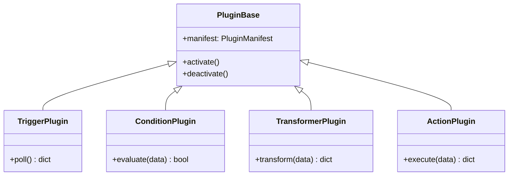

# Plugins

Concrete plugin implementations organized by type.

## Structure

| Directory | Type |
|-----------|------|
| `triggers/` | TriggerPlugin |
| `conditions/` | ConditionPlugin |
| `transformers/` | TransformerPlugin |
| `actions/` | ActionPlugin |

## Adding a Plugin

1. Create a module in the appropriate type directory
2. Implement the corresponding base class from `src.core.contracts`
3. Decorate with `@register_plugin` providing a `PluginManifest`
4. The plugin is collected at build time and added to the static registry

## Plugin Type Hierarchy

## Key ADRs

- **ADR-002** — Static Plugin Registration
- **ADR-004** — Plugin Isolation
- **ADR-005** — Plugin Contract Model
