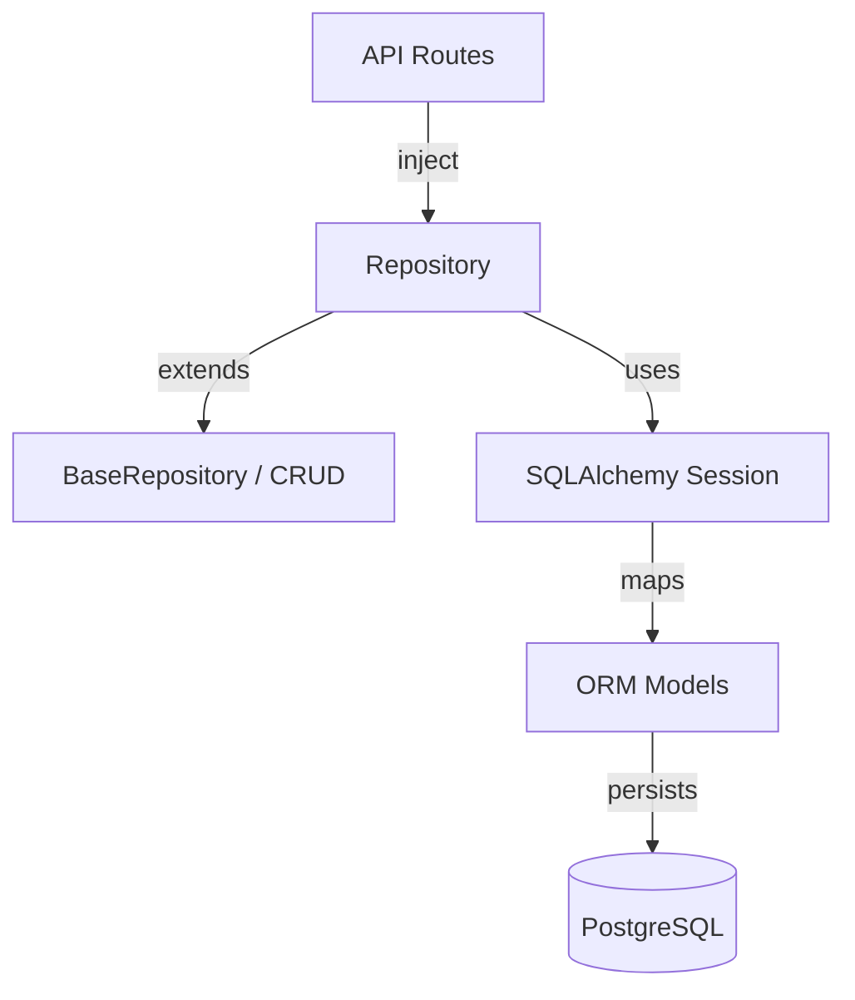

# Repositories

Repository pattern for data access, decoupling persistence logic from business logic.

## Structure

| Module | Purpose |
|--------|---------|
| `base/repository.py` | Abstract base repository interface |
| `base/crud.py` | Generic CRUD operations |
| `workflows.py` | Workflow-specific queries and persistence |
| `plugins.py` | Plugin record access |
| `executions.py` | Execution history queries |

## Layer Diagram

